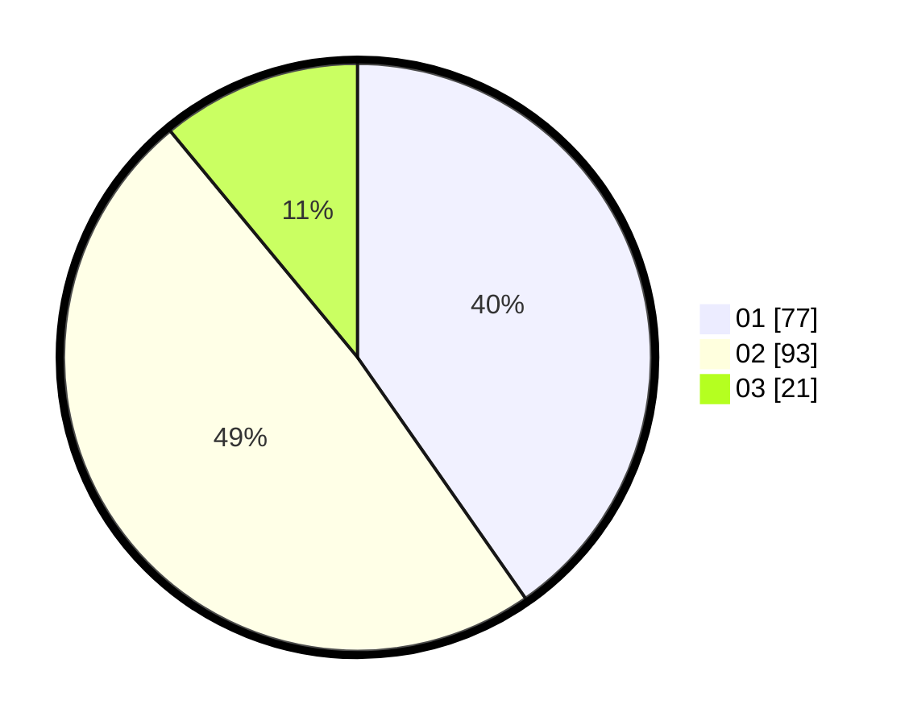

# Hasil

Hasil perolehan suara paslon dapat dilihat pada file paslon-01.txt, paslon-02.txt, dan paslon-03.txt.

Jika tidak ada, artinya data tersebut belum ada pada SIREKAP.

## Perolehan Suara

 * Paslon 01: **77**.
 * Paslon 02: **93**.
 * Paslon 03: **21**.

## Foto C Plano

https://sirekap-obj-formc.kpu.go.id/e507/pemilu/ppwp/31/75/07/10/03/3175071003187-20240214-160116--17fdfa5a-5816-4baa-9df6-13ff3728e753.jpg

https://sirekap-obj-formc.kpu.go.id/e507/pemilu/ppwp/31/75/07/10/03/3175071003187-20240214-160055--25659944-3d44-46d2-8554-63036b68fee5.jpg

https://sirekap-obj-formc.kpu.go.id/e507/pemilu/ppwp/31/75/07/10/03/3175071003187-20240214-160138--442538ab-4224-42f3-9563-2e197c8be2ab.jpg
