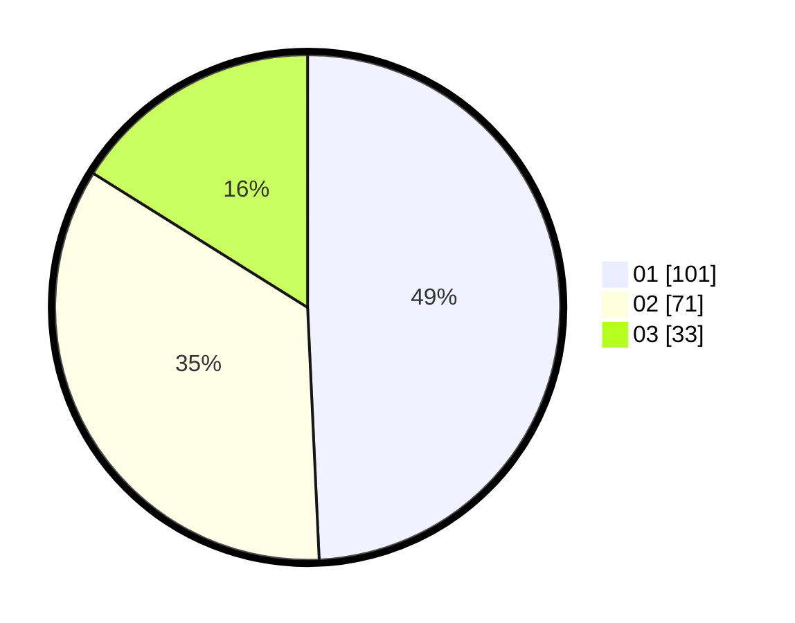

# Hasil

Hasil perolehan suara paslon dapat dilihat pada file paslon-01.txt, paslon-02.txt, dan paslon-03.txt.

Jika tidak ada, artinya data tersebut belum ada pada SIREKAP.

## Perolehan Suara

 * Paslon 01: **101**.
 * Paslon 02: **71**.
 * Paslon 03: **33**.

## Foto C Plano

https://sirekap-obj-formc.kpu.go.id/9022/pemilu/ppwp/31/75/07/10/03/3175071003193-20240216-160415--561f3f84-36f5-4568-9dc9-4f7c5b5ebdf5.jpg

https://sirekap-obj-formc.kpu.go.id/9022/pemilu/ppwp/31/75/07/10/03/3175071003193-20240216-160417--3f40ecf9-f8e1-4c97-9ccd-7e371ec908c0.jpg

https://sirekap-obj-formc.kpu.go.id/9022/pemilu/ppwp/31/75/07/10/03/3175071003193-20240216-160416--5d79d7af-6d58-4faf-a8d8-9fd5a2aa952f.jpg

## DATA PEMILIH TETAP

Jumlah pemilih dalam DPT: **283**.
 * L: **144**.
 * P: **139**.

## DATA PENGGUNA HAK PILIH

Jumlah pengguna hak pilih dalam DPT: **203**.
 * L: **105**.
 * P: **98**.

Jumlah pengguna hak pilih dalam DPTb: **2**.
 * L: **1**.
 * P: **1**.

Jumlah pengguna hak pilih dalam DPK: **1**.
 * L: **1**.
 * P: **0**.

Jumlah pengguna hak pilih: **206**.
 * L: **107**.
 * P: **99**.

## JUMLAH SUARA SAH DAN TIDAK SAH

JUMLAH SELURUH SUARA SAH: **205**.

JUMLAH SUARA TIDAK SAH: **1**.

JUMLAH SELURUH SUARA SAH DAN SUARA TIDAK SAH: **206**.
