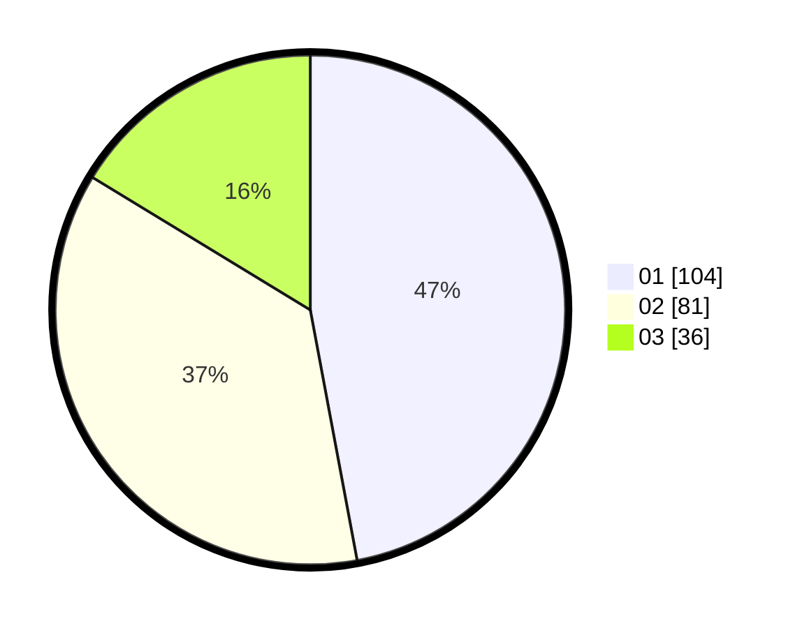

# Hasil

Hasil perolehan suara paslon dapat dilihat pada file paslon-01.txt, paslon-02.txt, dan paslon-03.txt.

Jika tidak ada, artinya data tersebut belum ada pada SIREKAP.

## Perolehan Suara

 * Paslon 01: **104**.
 * Paslon 02: **81**.
 * Paslon 03: **36**.

## Foto C Plano

https://sirekap-obj-formc.kpu.go.id/bce8/pemilu/ppwp/31/75/07/10/03/3175071003198-20240214-192527--15d34dd9-5142-4939-b515-76194d74e983.jpg

https://sirekap-obj-formc.kpu.go.id/bce8/pemilu/ppwp/31/75/07/10/03/3175071003198-20240214-210730--d6674307-5aaf-42a3-9dfe-fad9a13ece1c.jpg

https://sirekap-obj-formc.kpu.go.id/bce8/pemilu/ppwp/31/75/07/10/03/3175071003198-20240214-214024--3149cdc3-34d5-420d-bc52-07ecfa57a3c1.jpg

## DATA PEMILIH TETAP

Jumlah pemilih dalam DPT: **278**.
 * L: **136**.
 * P: **142**.

## DATA PENGGUNA HAK PILIH

Jumlah pengguna hak pilih dalam DPT: **212**.
 * L: **105**.
 * P: **107**.

Jumlah pengguna hak pilih dalam DPTb: **6**.
 * L: **3**.
 * P: **3**.

Jumlah pengguna hak pilih dalam DPK: **5**.
 * L: **2**.
 * P: **3**.

Jumlah pengguna hak pilih: **223**.
 * L: **110**.
 * P: **113**.

## JUMLAH SUARA SAH DAN TIDAK SAH

JUMLAH SELURUH SUARA SAH: **221**.

JUMLAH SUARA TIDAK SAH: **2**.

JUMLAH SELURUH SUARA SAH DAN SUARA TIDAK SAH: **223**.
