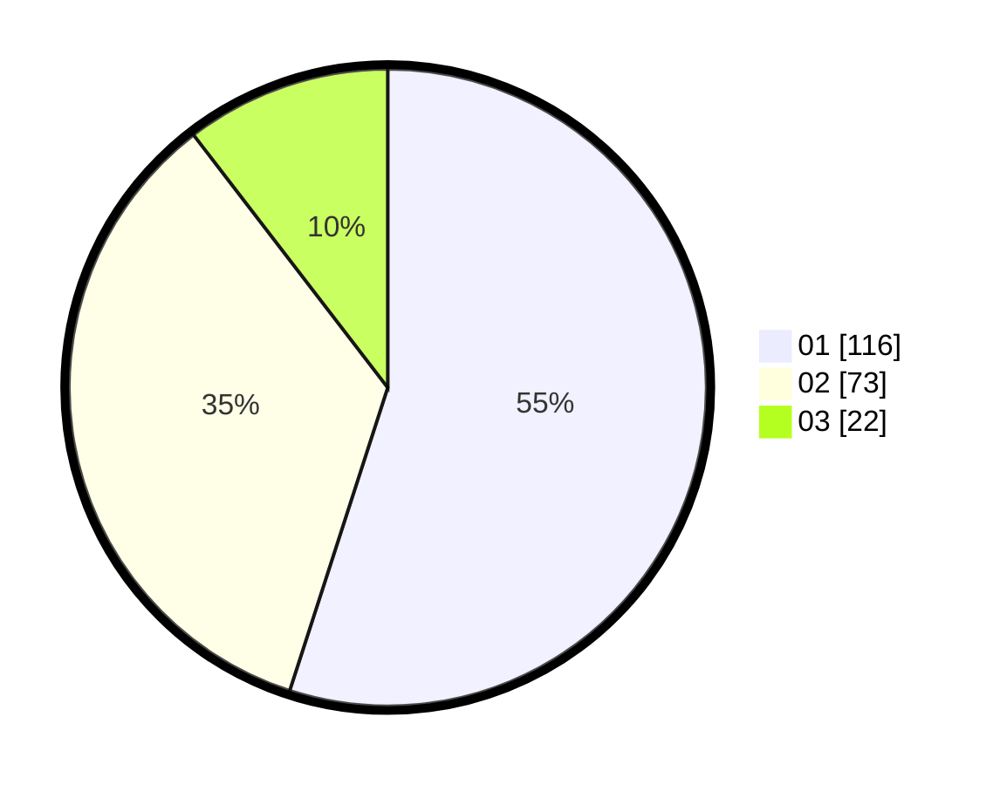

# Hasil

Hasil perolehan suara paslon dapat dilihat pada file paslon-01.txt, paslon-02.txt, dan paslon-03.txt.

Jika tidak ada, artinya data tersebut belum ada pada SIREKAP.

## Perolehan Suara

 * Paslon 01: **116**.
 * Paslon 02: **73**.
 * Paslon 03: **22**.

## Foto C Plano

https://sirekap-obj-formc.kpu.go.id/0ca5/pemilu/ppwp/31/75/07/10/03/3175071003204-20240216-150658--ac26314b-7239-453e-ac8d-1c5d4ab0a1b1.jpg

https://sirekap-obj-formc.kpu.go.id/0ca5/pemilu/ppwp/31/75/07/10/03/3175071003204-20240216-150659--7a50e288-394e-4c3a-84cf-f5dc9af1c106.jpg

https://sirekap-obj-formc.kpu.go.id/0ca5/pemilu/ppwp/31/75/07/10/03/3175071003204-20240216-150659--5276da11-b144-4a85-acdb-fee582743a8c.jpg

## DATA PEMILIH TETAP

Jumlah pemilih dalam DPT: **257**.
 * L: **127**.
 * P: **130**.

## DATA PENGGUNA HAK PILIH

Jumlah pengguna hak pilih dalam DPT: **204**.
 * L: **99**.
 * P: **105**.

Jumlah pengguna hak pilih dalam DPTb: **3**.
 * L: **1**.
 * P: **2**.

Jumlah pengguna hak pilih dalam DPK: **7**.
 * L: **3**.
 * P: **4**.

Jumlah pengguna hak pilih: **214**.
 * L: **103**.
 * P: **111**.

## JUMLAH SUARA SAH DAN TIDAK SAH

JUMLAH SELURUH SUARA SAH: **211**.

JUMLAH SUARA TIDAK SAH: **3**.

JUMLAH SELURUH SUARA SAH DAN SUARA TIDAK SAH: **214**.
