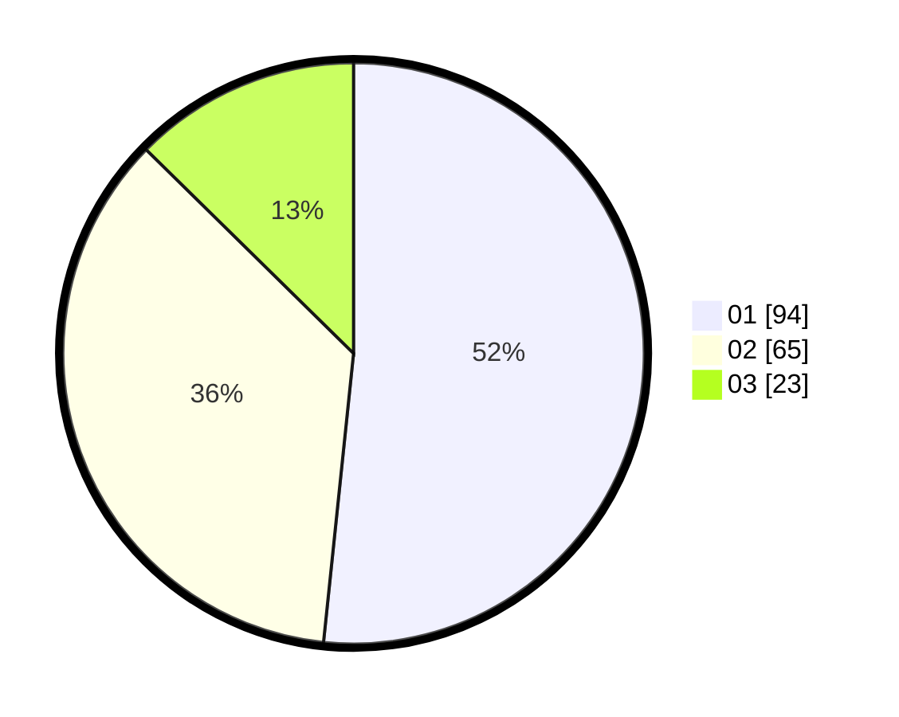

# Hasil

Hasil perolehan suara paslon dapat dilihat pada file paslon-01.txt, paslon-02.txt, dan paslon-03.txt.

Jika tidak ada, artinya data tersebut belum ada pada SIREKAP.

## Perolehan Suara

 * Paslon 01: **94**.
 * Paslon 02: **65**.
 * Paslon 03: **23**.

## Foto C Plano

https://sirekap-obj-formc.kpu.go.id/cb9b/pemilu/ppwp/31/75/07/10/03/3175071003205-20240216-155506--056a07bf-e855-464e-95f0-0c8a48a33138.jpg

https://sirekap-obj-formc.kpu.go.id/cb9b/pemilu/ppwp/31/75/07/10/03/3175071003205-20240216-155507--5459c299-5434-4016-868d-70b73f7d7275.jpg

https://sirekap-obj-formc.kpu.go.id/cb9b/pemilu/ppwp/31/75/07/10/03/3175071003205-20240216-155507--6264e64e-56a2-4c83-b450-5f605e9a7a27.jpg

## DATA PEMILIH TETAP

Jumlah pemilih dalam DPT: **176**.
 * L: **91**.
 * P: **85**.

## DATA PENGGUNA HAK PILIH

Jumlah pengguna hak pilih dalam DPT: **176**.
 * L: **91**.
 * P: **85**.

Jumlah pengguna hak pilih dalam DPTb: **2**.
 * L: **2**.
 * P: **0**.

Jumlah pengguna hak pilih dalam DPK: **5**.
 * L: **1**.
 * P: **4**.

Jumlah pengguna hak pilih: **183**.
 * L: **94**.
 * P: **89**.

## JUMLAH SUARA SAH DAN TIDAK SAH

JUMLAH SELURUH SUARA SAH: **182**.

JUMLAH SUARA TIDAK SAH: **1**.

JUMLAH SELURUH SUARA SAH DAN SUARA TIDAK SAH: **183**.
