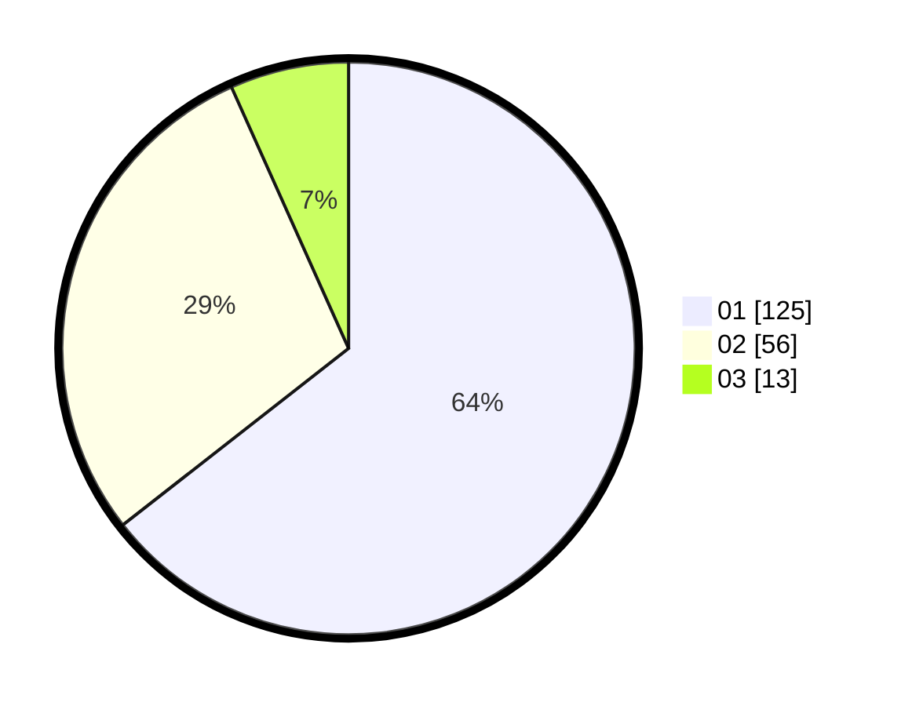

# Hasil

Hasil perolehan suara paslon dapat dilihat pada file paslon-01.txt, paslon-02.txt, dan paslon-03.txt.

Jika tidak ada, artinya data tersebut belum ada pada SIREKAP.

## Perolehan Suara

 * Paslon 01: **125**.
 * Paslon 02: **56**.
 * Paslon 03: **13**.

## Foto C Plano

https://sirekap-obj-formc.kpu.go.id/9ac6/pemilu/ppwp/31/75/07/10/03/3175071003208-20240214-193416--0cbe9b6e-8852-473e-b90d-508646a4756d.jpg

https://sirekap-obj-formc.kpu.go.id/9ac6/pemilu/ppwp/31/75/07/10/03/3175071003208-20240214-200813--90ab6699-85c0-40ba-9524-e1ed159ed3a2.jpg

https://sirekap-obj-formc.kpu.go.id/9ac6/pemilu/ppwp/31/75/07/10/03/3175071003208-20240214-201149--95e72a73-57dc-4ee8-b8c6-b57fc9551633.jpg

## DATA PEMILIH TETAP

Jumlah pemilih dalam DPT: **193**.
 * L: **104**.
 * P: **89**.

## DATA PENGGUNA HAK PILIH

Jumlah pengguna hak pilih dalam DPT: **193**.
 * L: **104**.
 * P: **89**.

Jumlah pengguna hak pilih dalam DPTb: **2**.
 * L: **1**.
 * P: **1**.

Jumlah pengguna hak pilih dalam DPK: **5**.
 * L: **2**.
 * P: **3**.

Jumlah pengguna hak pilih: **200**.
 * L: **107**.
 * P: **93**.

## JUMLAH SUARA SAH DAN TIDAK SAH

JUMLAH SELURUH SUARA SAH: **194**.

JUMLAH SUARA TIDAK SAH: **6**.

JUMLAH SELURUH SUARA SAH DAN SUARA TIDAK SAH: **200**.
