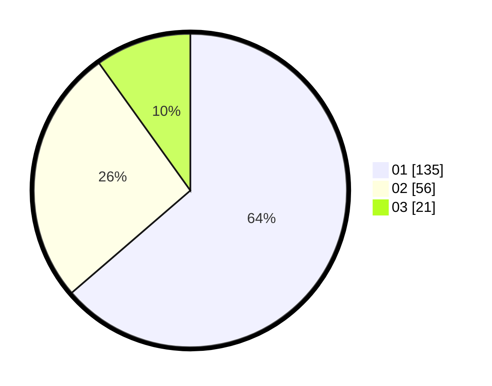

# Hasil

Hasil perolehan suara paslon dapat dilihat pada file paslon-01.txt, paslon-02.txt, dan paslon-03.txt.

Jika tidak ada, artinya data tersebut belum ada pada SIREKAP.

## Perolehan Suara

 * Paslon 01: **135**.
 * Paslon 02: **56**.
 * Paslon 03: **21**.

## Foto C Plano

https://sirekap-obj-formc.kpu.go.id/039f/pemilu/ppwp/31/75/07/10/03/3175071003209-20240214-195910--d56332b8-aca6-498e-bf2c-41be503e04ff.jpg

https://sirekap-obj-formc.kpu.go.id/039f/pemilu/ppwp/31/75/07/10/03/3175071003209-20240214-195952--b48ce68f-427c-4a5a-946c-ce3d00489bf9.jpg

https://sirekap-obj-formc.kpu.go.id/039f/pemilu/ppwp/31/75/07/10/03/3175071003209-20240214-200033--bc1cec23-84fc-4536-abf7-0d4d02add53f.jpg

## DATA PEMILIH TETAP

Jumlah pemilih dalam DPT: **260**.
 * L: **130**.
 * P: **130**.

## DATA PENGGUNA HAK PILIH

Jumlah pengguna hak pilih dalam DPT: **213**.
 * L: **99**.
 * P: **114**.

Jumlah pengguna hak pilih dalam DPTb: **1**.
 * L: **1**.
 * P: **0**.

Jumlah pengguna hak pilih dalam DPK: **0**.
 * L: **0**.
 * P: **0**.

Jumlah pengguna hak pilih: **214**.
 * L: **100**.
 * P: **114**.

## JUMLAH SUARA SAH DAN TIDAK SAH

JUMLAH SELURUH SUARA SAH: **212**.

JUMLAH SUARA TIDAK SAH: **2**.

JUMLAH SELURUH SUARA SAH DAN SUARA TIDAK SAH: **214**.
