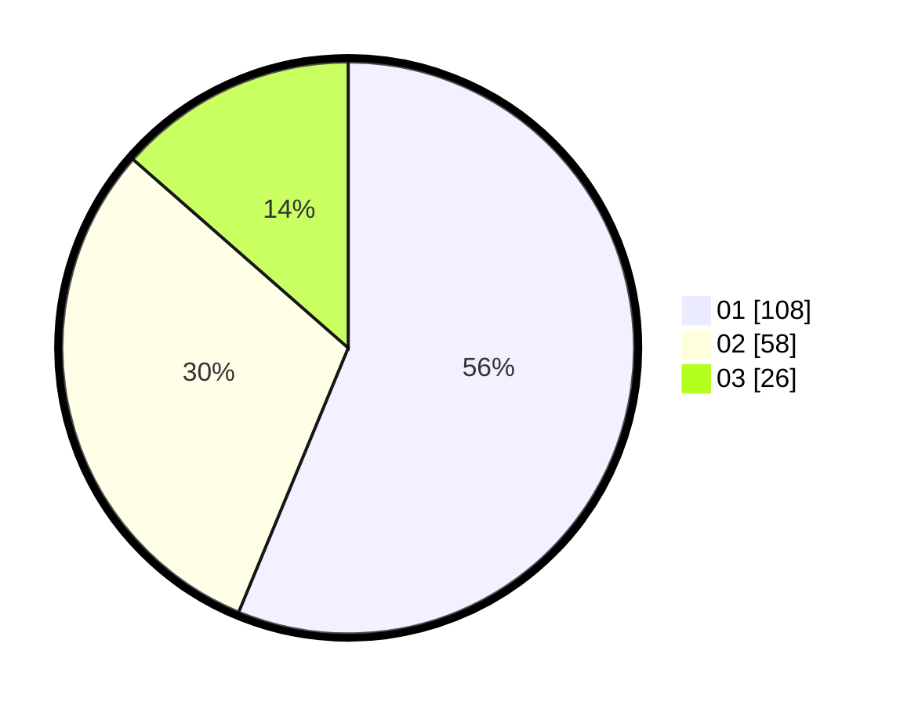

# Hasil

Hasil perolehan suara paslon dapat dilihat pada file paslon-01.txt, paslon-02.txt, dan paslon-03.txt.

Jika tidak ada, artinya data tersebut belum ada pada SIREKAP.

## Perolehan Suara

 * Paslon 01: **108**.
 * Paslon 02: **58**.
 * Paslon 03: **26**.

## Foto C Plano

https://sirekap-obj-formc.kpu.go.id/7e5a/pemilu/ppwp/31/75/07/10/03/3175071003212-20240215-020503--c9202b0c-9066-4cc2-9248-a09db5bb8483.jpg

https://sirekap-obj-formc.kpu.go.id/7e5a/pemilu/ppwp/31/75/07/10/03/3175071003212-20240215-020555--a1709d4f-56d5-49d7-ba63-2e3dabbcc7e9.jpg

https://sirekap-obj-formc.kpu.go.id/7e5a/pemilu/ppwp/31/75/07/10/03/3175071003212-20240215-020623--efff579f-a5f1-4c1b-bcc7-2fc4dcfc6a56.jpg

## DATA PEMILIH TETAP

Jumlah pemilih dalam DPT: **263**.
 * L: **126**.
 * P: **137**.

## DATA PENGGUNA HAK PILIH

Jumlah pengguna hak pilih dalam DPT: **194**.
 * L: **86**.
 * P: **108**.

Jumlah pengguna hak pilih dalam DPTb: **2**.
 * L: **1**.
 * P: **1**.

Jumlah pengguna hak pilih dalam DPK: **0**.
 * L: **0**.
 * P: **0**.

Jumlah pengguna hak pilih: **196**.
 * L: **87**.
 * P: **109**.

## JUMLAH SUARA SAH DAN TIDAK SAH

JUMLAH SELURUH SUARA SAH: **192**.

JUMLAH SUARA TIDAK SAH: **4**.

JUMLAH SELURUH SUARA SAH DAN SUARA TIDAK SAH: **196**.
