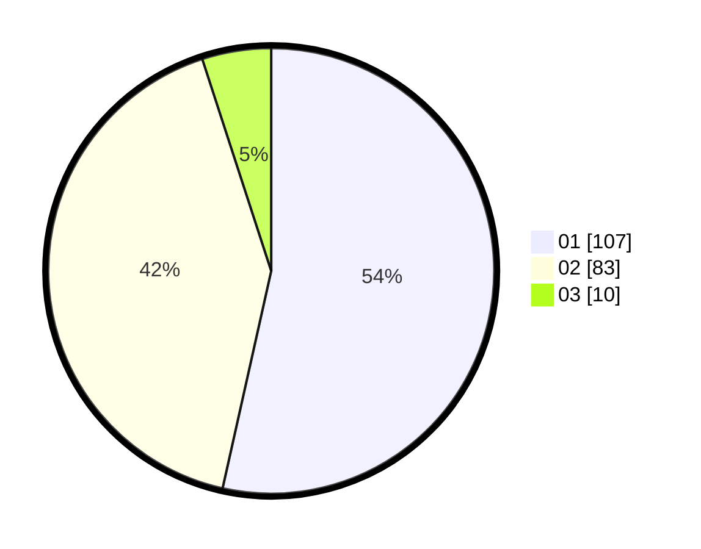

# Hasil

Hasil perolehan suara paslon dapat dilihat pada file paslon-01.txt, paslon-02.txt, dan paslon-03.txt.

Jika tidak ada, artinya data tersebut belum ada pada SIREKAP.

## Perolehan Suara

 * Paslon 01: **107**.
 * Paslon 02: **83**.
 * Paslon 03: **10**.

## Foto C Plano

https://sirekap-obj-formc.kpu.go.id/d788/pemilu/ppwp/31/75/07/10/03/3175071003222-20240214-220914--2c54eec5-249a-4967-9b2c-32c3aa0971f4.jpg

https://sirekap-obj-formc.kpu.go.id/d788/pemilu/ppwp/31/75/07/10/03/3175071003222-20240214-221746--9422e7e6-e736-4395-b642-b5e06619eecb.jpg

https://sirekap-obj-formc.kpu.go.id/d788/pemilu/ppwp/31/75/07/10/03/3175071003222-20240214-221850--6892f386-033b-4188-9417-f4c310bbe504.jpg
