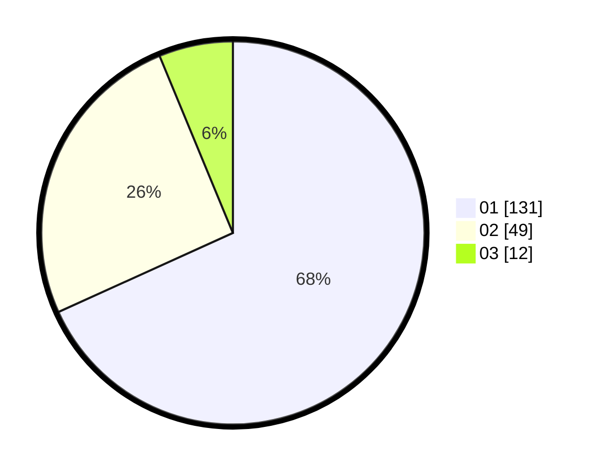

# Hasil

Hasil perolehan suara paslon dapat dilihat pada file paslon-01.txt, paslon-02.txt, dan paslon-03.txt.

Jika tidak ada, artinya data tersebut belum ada pada SIREKAP.

## Perolehan Suara

 * Paslon 01: **131**.
 * Paslon 02: **49**.
 * Paslon 03: **12**.

## Foto C Plano

https://sirekap-obj-formc.kpu.go.id/2070/pemilu/ppwp/31/75/07/10/03/3175071003229-20240215-214808--7261c01d-d6cb-4124-9d66-0c917dcb2edc.jpg

https://sirekap-obj-formc.kpu.go.id/2070/pemilu/ppwp/31/75/07/10/03/3175071003229-20240215-214810--f955d4f8-74fc-4164-ae47-bda2f057e075.jpg

https://sirekap-obj-formc.kpu.go.id/2070/pemilu/ppwp/31/75/07/10/03/3175071003229-20240215-214808--d8a4b489-56d2-4963-8876-efeb7c108d08.jpg

## DATA PEMILIH TETAP

Jumlah pemilih dalam DPT: **253**.
 * L: **121**.
 * P: **132**.

## DATA PENGGUNA HAK PILIH

Jumlah pengguna hak pilih dalam DPT: **196**.
 * L: **93**.
 * P: **103**.

Jumlah pengguna hak pilih dalam DPTb: **0**.
 * L: **0**.
 * P: **0**.

Jumlah pengguna hak pilih dalam DPK: **0**.
 * L: **0**.
 * P: **0**.

Jumlah pengguna hak pilih: **196**.
 * L: **93**.
 * P: **103**.

## JUMLAH SUARA SAH DAN TIDAK SAH

JUMLAH SELURUH SUARA SAH: **192**.

JUMLAH SUARA TIDAK SAH: **4**.

JUMLAH SELURUH SUARA SAH DAN SUARA TIDAK SAH: **196**.
