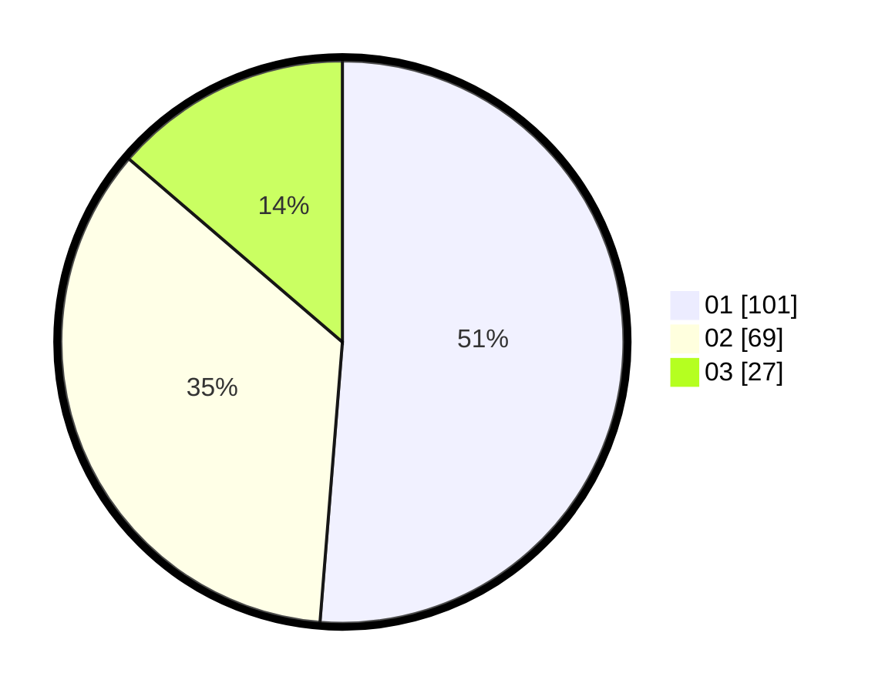

# Hasil

Hasil perolehan suara paslon dapat dilihat pada file paslon-01.txt, paslon-02.txt, dan paslon-03.txt.

Jika tidak ada, artinya data tersebut belum ada pada SIREKAP.

## Perolehan Suara

 * Paslon 01: **101**.
 * Paslon 02: **69**.
 * Paslon 03: **27**.

## Foto C Plano

https://sirekap-obj-formc.kpu.go.id/93af/pemilu/ppwp/31/75/07/10/03/3175071003230-20240216-022059--e95ef84b-9fb9-41fa-8246-089c1798febe.jpg

https://sirekap-obj-formc.kpu.go.id/93af/pemilu/ppwp/31/75/07/10/03/3175071003230-20240216-022101--f3388a16-3ae7-4e84-9cb6-a69f31be2fd3.jpg

https://sirekap-obj-formc.kpu.go.id/93af/pemilu/ppwp/31/75/07/10/03/3175071003230-20240216-022100--3eaa689c-0f10-4043-bd17-392eb8a06997.jpg

## DATA PEMILIH TETAP

Jumlah pemilih dalam DPT: **259**.
 * L: **134**.
 * P: **125**.

## DATA PENGGUNA HAK PILIH

Jumlah pengguna hak pilih dalam DPT: **196**.
 * L: **91**.
 * P: **105**.

Jumlah pengguna hak pilih dalam DPTb: **2**.
 * L: **1**.
 * P: **1**.

Jumlah pengguna hak pilih dalam DPK: **2**.
 * L: **1**.
 * P: **1**.

Jumlah pengguna hak pilih: **200**.
 * L: **93**.
 * P: **107**.

## JUMLAH SUARA SAH DAN TIDAK SAH

JUMLAH SELURUH SUARA SAH: **197**.

JUMLAH SUARA TIDAK SAH: **3**.

JUMLAH SELURUH SUARA SAH DAN SUARA TIDAK SAH: **200**.
