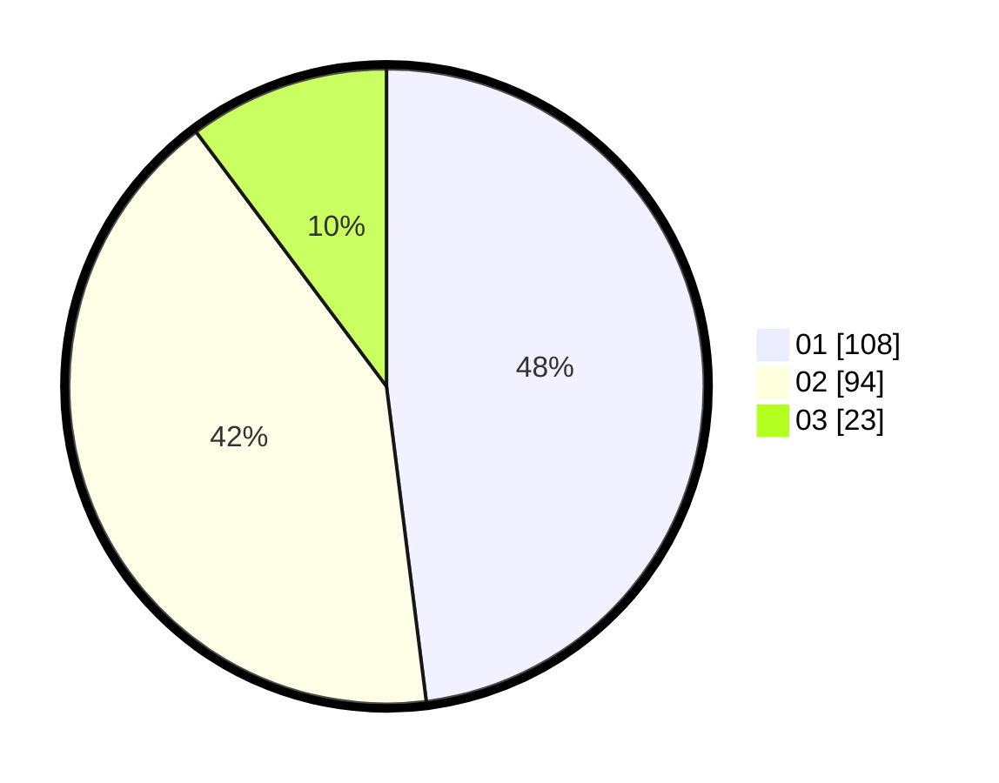

# Hasil

Hasil perolehan suara paslon dapat dilihat pada file paslon-01.txt, paslon-02.txt, dan paslon-03.txt.

Jika tidak ada, artinya data tersebut belum ada pada SIREKAP.

## Perolehan Suara

 * Paslon 01: **108**.
 * Paslon 02: **94**.
 * Paslon 03: **23**.

## Foto C Plano

https://sirekap-obj-formc.kpu.go.id/c146/pemilu/ppwp/31/75/07/10/03/3175071003231-20240216-062544--d082fbda-5810-4a78-bc82-df4af1a57eac.jpg

https://sirekap-obj-formc.kpu.go.id/c146/pemilu/ppwp/31/75/07/10/03/3175071003231-20240216-062545--0addf8a0-210b-441c-8e1c-051f1f1a2aa3.jpg

https://sirekap-obj-formc.kpu.go.id/c146/pemilu/ppwp/31/75/07/10/03/3175071003231-20240216-062544--0d8cccae-f7bc-481c-9759-730d2eeac2e2.jpg

## DATA PEMILIH TETAP

Jumlah pemilih dalam DPT: **221**.
 * L: **109**.
 * P: **112**.

## DATA PENGGUNA HAK PILIH

Jumlah pengguna hak pilih dalam DPT: **221**.
 * L: **109**.
 * P: **112**.

Jumlah pengguna hak pilih dalam DPTb: **0**.
 * L: **0**.
 * P: **0**.

Jumlah pengguna hak pilih dalam DPK: **5**.
 * L: **3**.
 * P: **2**.

Jumlah pengguna hak pilih: **0**.
 * L: **0**.
 * P: **0**.

## JUMLAH SUARA SAH DAN TIDAK SAH

JUMLAH SELURUH SUARA SAH: **225**.

JUMLAH SUARA TIDAK SAH: **1**.

JUMLAH SELURUH SUARA SAH DAN SUARA TIDAK SAH: **226**.
