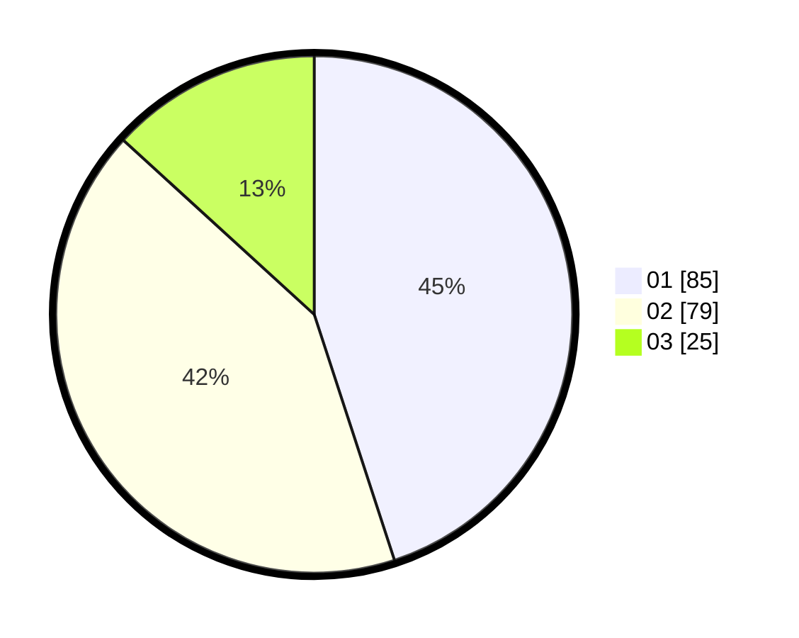

# Hasil

Hasil perolehan suara paslon dapat dilihat pada file paslon-01.txt, paslon-02.txt, dan paslon-03.txt.

Jika tidak ada, artinya data tersebut belum ada pada SIREKAP.

## Perolehan Suara

 * Paslon 01: **85**.
 * Paslon 02: **79**.
 * Paslon 03: **25**.

## Foto C Plano

https://sirekap-obj-formc.kpu.go.id/f867/pemilu/ppwp/31/75/07/10/03/3175071003232-20240214-201029--7ff0ccf8-8bff-4de0-8ba2-93d8c426d756.jpg

https://sirekap-obj-formc.kpu.go.id/f867/pemilu/ppwp/31/75/07/10/03/3175071003232-20240214-204703--25838e65-eee6-47be-a0fe-ab5f408a6dce.jpg

https://sirekap-obj-formc.kpu.go.id/f867/pemilu/ppwp/31/75/07/10/03/3175071003232-20240214-194843--ce396ce0-1bab-41bf-aedd-64de52e59ca5.jpg

## DATA PEMILIH TETAP

Jumlah pemilih dalam DPT: **195**.
 * L: **91**.
 * P: **104**.

## DATA PENGGUNA HAK PILIH

Jumlah pengguna hak pilih dalam DPT: **192**.
 * L: **91**.
 * P: **101**.

Jumlah pengguna hak pilih dalam DPTb: **1**.
 * L: **0**.
 * P: **1**.

Jumlah pengguna hak pilih dalam DPK: **2**.
 * L: **0**.
 * P: **2**.

Jumlah pengguna hak pilih: **195**.
 * L: **91**.
 * P: **104**.

## JUMLAH SUARA SAH DAN TIDAK SAH

JUMLAH SELURUH SUARA SAH: **189**.

JUMLAH SUARA TIDAK SAH: **6**.

JUMLAH SELURUH SUARA SAH DAN SUARA TIDAK SAH: **195**.
