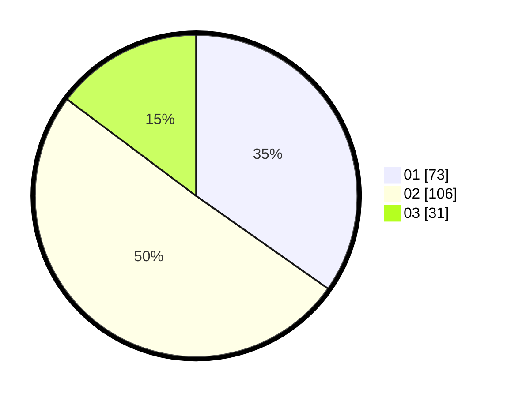

# Hasil

Hasil perolehan suara paslon dapat dilihat pada file paslon-01.txt, paslon-02.txt, dan paslon-03.txt.

Jika tidak ada, artinya data tersebut belum ada pada SIREKAP.

## Perolehan Suara

 * Paslon 01: **73**.
 * Paslon 02: **106**.
 * Paslon 03: **31**.

## Foto C Plano

https://sirekap-obj-formc.kpu.go.id/5fdd/pemilu/ppwp/31/75/07/10/03/3175071003234-20240215-214133--50ce8f15-6865-43b3-b814-1f036cabe472.jpg

https://sirekap-obj-formc.kpu.go.id/5fdd/pemilu/ppwp/31/75/07/10/03/3175071003234-20240215-214135--e7acc3bd-56fe-455c-9c81-7940e3380750.jpg

https://sirekap-obj-formc.kpu.go.id/5fdd/pemilu/ppwp/31/75/07/10/03/3175071003234-20240215-214134--5061536d-6838-4d38-a5ab-758a97dd61c0.jpg

## DATA PEMILIH TETAP

Jumlah pemilih dalam DPT: **0**.
 * L: **0**.
 * P: **0**.

## DATA PENGGUNA HAK PILIH

Jumlah pengguna hak pilih dalam DPT: **0**.
 * L: **0**.
 * P: **0**.

Jumlah pengguna hak pilih dalam DPTb: **0**.
 * L: **0**.
 * P: **0**.

Jumlah pengguna hak pilih dalam DPK: **0**.
 * L: **0**.
 * P: **0**.

Jumlah pengguna hak pilih: **0**.
 * L: **0**.
 * P: **0**.

## JUMLAH SUARA SAH DAN TIDAK SAH

JUMLAH SELURUH SUARA SAH: **210**.

JUMLAH SUARA TIDAK SAH: **2**.

JUMLAH SELURUH SUARA SAH DAN SUARA TIDAK SAH: **212**.
