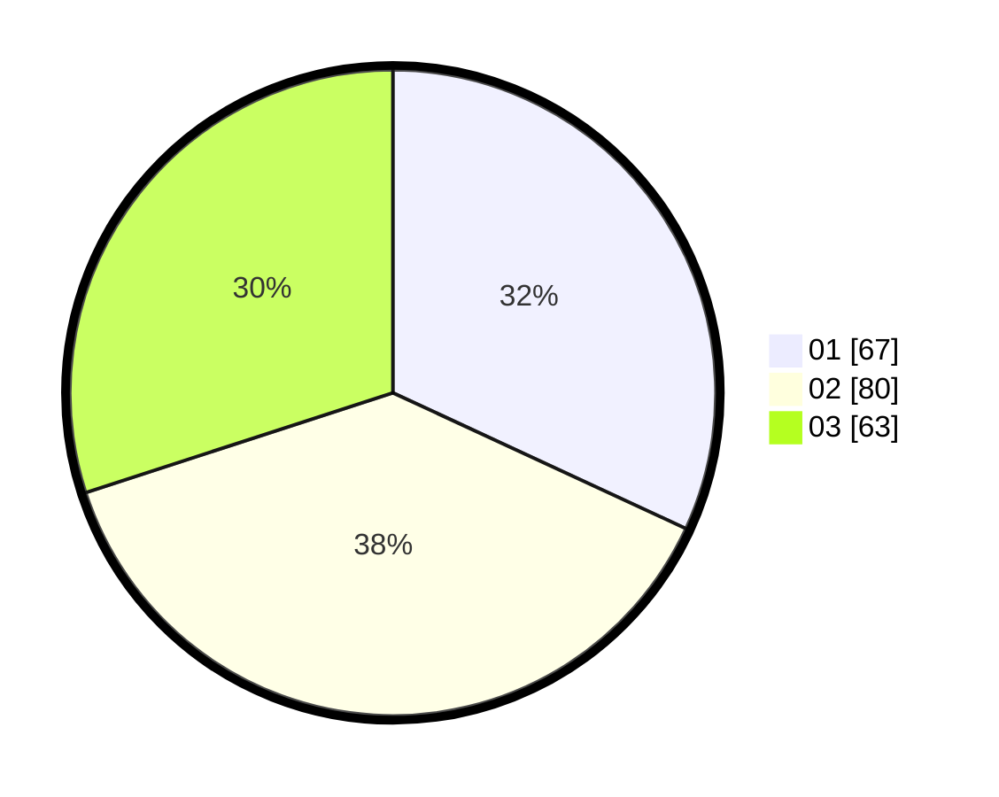

# Hasil

Hasil perolehan suara paslon dapat dilihat pada file paslon-01.txt, paslon-02.txt, dan paslon-03.txt.

Jika tidak ada, artinya data tersebut belum ada pada SIREKAP.

## Perolehan Suara

 * Paslon 01: **67**.
 * Paslon 02: **80**.
 * Paslon 03: **63**.

## Foto C Plano

https://sirekap-obj-formc.kpu.go.id/5bd1/pemilu/ppwp/31/75/07/10/03/3175071003237-20240214-195759--de602b46-e4e7-4542-a559-9527bf602940.jpg

https://sirekap-obj-formc.kpu.go.id/5bd1/pemilu/ppwp/31/75/07/10/03/3175071003237-20240214-195926--1297f4a8-873f-477e-aca8-362dd6517f98.jpg

https://sirekap-obj-formc.kpu.go.id/5bd1/pemilu/ppwp/31/75/07/10/03/3175071003237-20240214-200032--f8208938-c9bf-4341-b29d-c9935499d5cf.jpg
