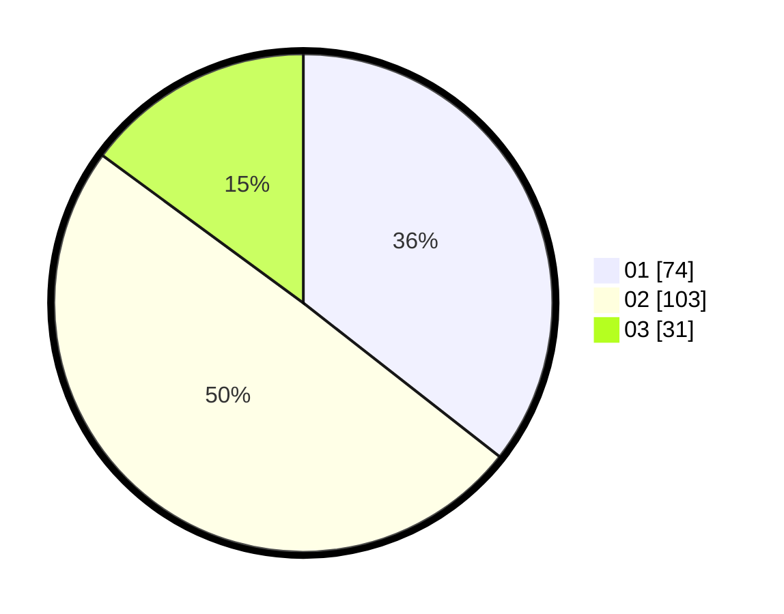

# Hasil

Hasil perolehan suara paslon dapat dilihat pada file paslon-01.txt, paslon-02.txt, dan paslon-03.txt.

Jika tidak ada, artinya data tersebut belum ada pada SIREKAP.

## Perolehan Suara

 * Paslon 01: **74**.
 * Paslon 02: **103**.
 * Paslon 03: **31**.

## Foto C Plano

https://sirekap-obj-formc.kpu.go.id/7238/pemilu/ppwp/31/75/07/10/04/3175071004012-20240214-210345--0449e4ae-358d-450c-8a1c-2bad20b53e12.jpg

https://sirekap-obj-formc.kpu.go.id/7238/pemilu/ppwp/31/75/07/10/04/3175071004012-20240214-210350--ea77a3d0-a6fb-4c9d-9967-8574e39981ac.jpg

https://sirekap-obj-formc.kpu.go.id/7238/pemilu/ppwp/31/75/07/10/04/3175071004012-20240214-210355--a624b4e2-5a03-4437-bb54-8258c98f5429.jpg

## DATA PEMILIH TETAP

Jumlah pemilih dalam DPT: **262**.
 * L: **137**.
 * P: **125**.

## DATA PENGGUNA HAK PILIH

Jumlah pengguna hak pilih dalam DPT: **208**.
 * L: **102**.
 * P: **106**.

Jumlah pengguna hak pilih dalam DPTb: **3**.
 * L: **1**.
 * P: **2**.

Jumlah pengguna hak pilih dalam DPK: **0**.
 * L: **0**.
 * P: **0**.

Jumlah pengguna hak pilih: **211**.
 * L: **103**.
 * P: **108**.

## JUMLAH SUARA SAH DAN TIDAK SAH

JUMLAH SELURUH SUARA SAH: **208**.

JUMLAH SUARA TIDAK SAH: **3**.

JUMLAH SELURUH SUARA SAH DAN SUARA TIDAK SAH: **211**.
