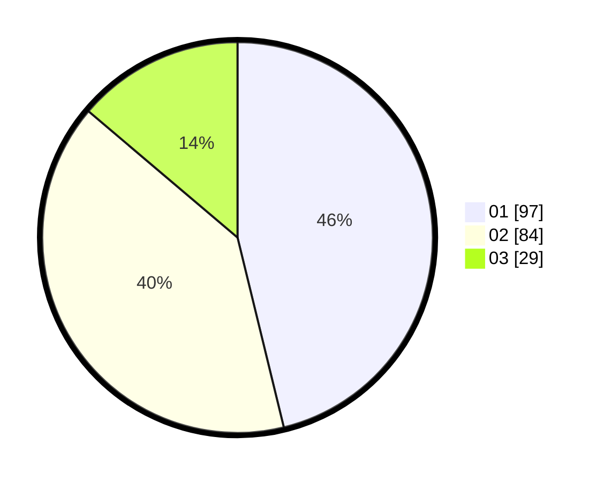

# Hasil

Hasil perolehan suara paslon dapat dilihat pada file paslon-01.txt, paslon-02.txt, dan paslon-03.txt.

Jika tidak ada, artinya data tersebut belum ada pada SIREKAP.

## Perolehan Suara

 * Paslon 01: **97**.
 * Paslon 02: **84**.
 * Paslon 03: **29**.

## Foto C Plano

https://sirekap-obj-formc.kpu.go.id/2800/pemilu/ppwp/31/75/07/10/04/3175071004014-20240215-112347--aff829a2-fddf-467c-a642-67009030c085.jpg

https://sirekap-obj-formc.kpu.go.id/2800/pemilu/ppwp/31/75/07/10/04/3175071004014-20240215-112515--b6a20ab3-8c6d-42d1-aed8-e7db483a2993.jpg

https://sirekap-obj-formc.kpu.go.id/2800/pemilu/ppwp/31/75/07/10/04/3175071004014-20240215-112648--949b7876-b082-4618-a1dd-b14dc0ffe91e.jpg
