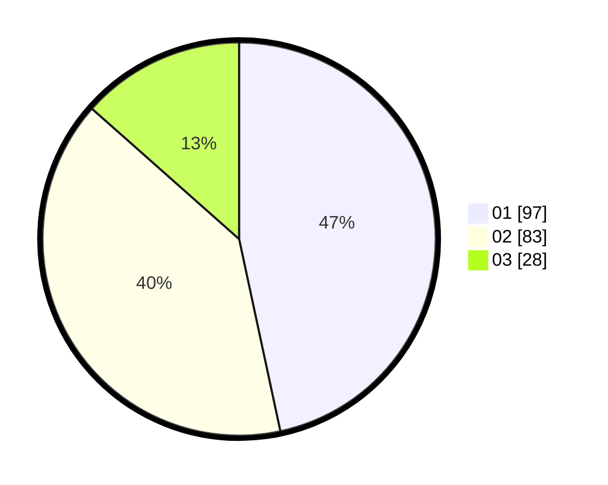

# Hasil

Hasil perolehan suara paslon dapat dilihat pada file paslon-01.txt, paslon-02.txt, dan paslon-03.txt.

Jika tidak ada, artinya data tersebut belum ada pada SIREKAP.

## Perolehan Suara

 * Paslon 01: **97**.
 * Paslon 02: **83**.
 * Paslon 03: **28**.

## Foto C Plano

https://sirekap-obj-formc.kpu.go.id/f720/pemilu/ppwp/31/75/07/10/04/3175071004022-20240214-214644--256a65a3-9a5b-419e-8629-fe5b448f5de5.jpg

https://sirekap-obj-formc.kpu.go.id/f720/pemilu/ppwp/31/75/07/10/04/3175071004022-20240214-214752--24043160-544a-4a01-81dd-acc1370a1f2b.jpg

https://sirekap-obj-formc.kpu.go.id/f720/pemilu/ppwp/31/75/07/10/04/3175071004022-20240214-214836--d61a7e29-cb23-43b4-b453-54dd90691a03.jpg
