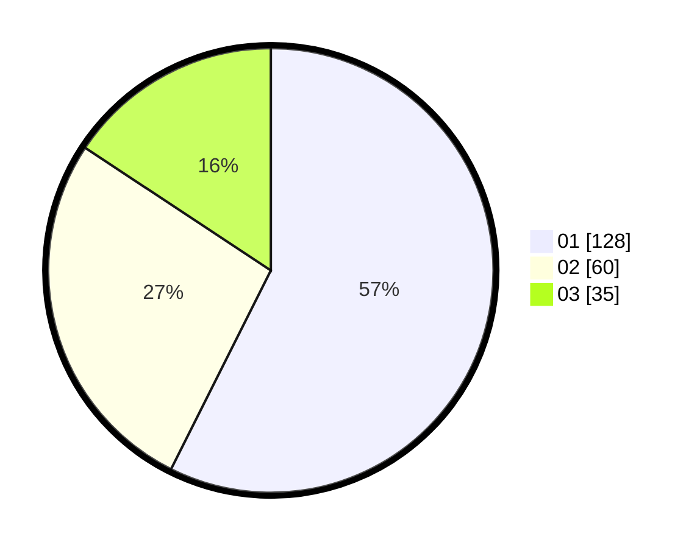

# Hasil

Hasil perolehan suara paslon dapat dilihat pada file paslon-01.txt, paslon-02.txt, dan paslon-03.txt.

Jika tidak ada, artinya data tersebut belum ada pada SIREKAP.

## Perolehan Suara

 * Paslon 01: **128**.
 * Paslon 02: **60**.
 * Paslon 03: **35**.

## Foto C Plano

https://sirekap-obj-formc.kpu.go.id/ce7b/pemilu/ppwp/31/75/07/10/04/3175071004025-20240215-000724--126004f8-226a-40f6-be2e-7cecbe1b892a.jpg

https://sirekap-obj-formc.kpu.go.id/ce7b/pemilu/ppwp/31/75/07/10/04/3175071004025-20240215-000842--1b086225-6e54-4e9a-965f-45c4a2e8f5a5.jpg

https://sirekap-obj-formc.kpu.go.id/ce7b/pemilu/ppwp/31/75/07/10/04/3175071004025-20240215-000924--45e1adb8-a9ac-4fc7-9c65-8b432ccde07f.jpg
