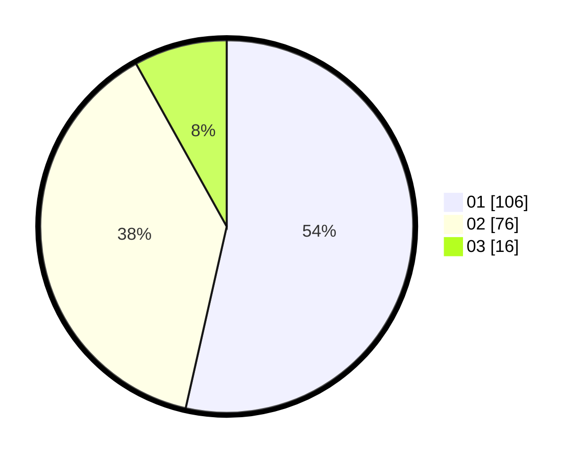

# Hasil

Hasil perolehan suara paslon dapat dilihat pada file paslon-01.txt, paslon-02.txt, dan paslon-03.txt.

Jika tidak ada, artinya data tersebut belum ada pada SIREKAP.

## Perolehan Suara

 * Paslon 01: **106**.
 * Paslon 02: **76**.
 * Paslon 03: **16**.

## Foto C Plano

https://sirekap-obj-formc.kpu.go.id/5764/pemilu/ppwp/31/75/07/10/04/3175071004026-20240214-194440--f4b317e5-6a9e-455a-971b-9b53acaf0ac6.jpg

https://sirekap-obj-formc.kpu.go.id/5764/pemilu/ppwp/31/75/07/10/04/3175071004026-20240214-194531--270dcff5-4bdd-4dc6-9e9b-4bd68ad2af47.jpg

https://sirekap-obj-formc.kpu.go.id/5764/pemilu/ppwp/31/75/07/10/04/3175071004026-20240214-194609--fd51c001-770a-4b11-836e-04aca1380605.jpg

## DATA PEMILIH TETAP

Jumlah pemilih dalam DPT: **224**.
 * L: **112**.
 * P: **112**.

## DATA PENGGUNA HAK PILIH

Jumlah pengguna hak pilih dalam DPT: **183**.
 * L: **88**.
 * P: **95**.

Jumlah pengguna hak pilih dalam DPTb: **14**.
 * L: **9**.
 * P: **5**.

Jumlah pengguna hak pilih dalam DPK: **1**.
 * L: **1**.
 * P: **0**.

Jumlah pengguna hak pilih: **198**.
 * L: **98**.
 * P: **100**.

## JUMLAH SUARA SAH DAN TIDAK SAH

JUMLAH SELURUH SUARA SAH: **198**.

JUMLAH SUARA TIDAK SAH: **0**.

JUMLAH SELURUH SUARA SAH DAN SUARA TIDAK SAH: **198**.
