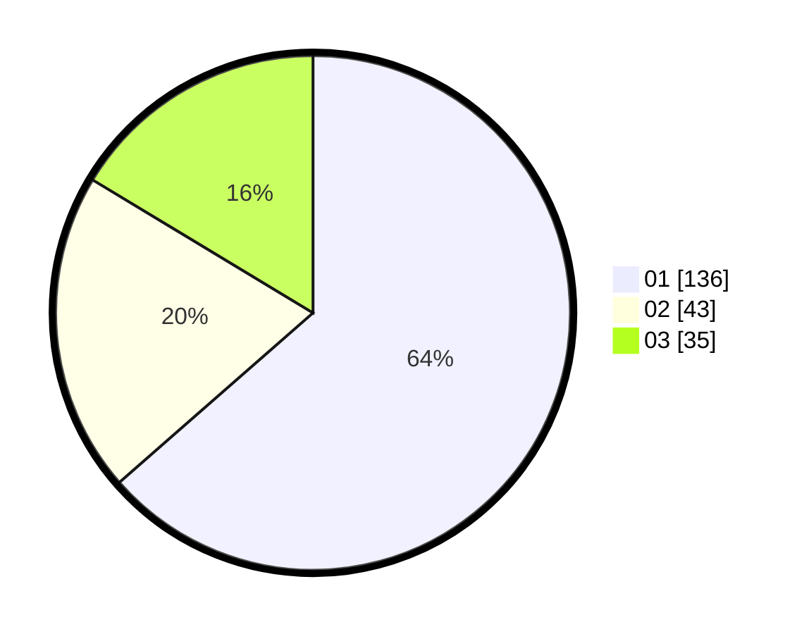

# Hasil

Hasil perolehan suara paslon dapat dilihat pada file paslon-01.txt, paslon-02.txt, dan paslon-03.txt.

Jika tidak ada, artinya data tersebut belum ada pada SIREKAP.

## Perolehan Suara

 * Paslon 01: **136**.
 * Paslon 02: **43**.
 * Paslon 03: **35**.

## Foto C Plano

https://sirekap-obj-formc.kpu.go.id/2283/pemilu/ppwp/31/75/07/10/04/3175071004027-20240217-004600--0cfc9403-c1d0-4d18-aa45-92aa0339a9bb.jpg

https://sirekap-obj-formc.kpu.go.id/2283/pemilu/ppwp/31/75/07/10/04/3175071004027-20240215-000750--40daf70b-91af-4f32-87b9-c20762b15dca.jpg

https://sirekap-obj-formc.kpu.go.id/2283/pemilu/ppwp/31/75/07/10/04/3175071004027-20240217-004936--e3155d67-c886-4cc6-a6e2-6adb8e52f410.jpg

## DATA PEMILIH TETAP

Jumlah pemilih dalam DPT: **226**.
 * L: **108**.
 * P: **118**.

## DATA PENGGUNA HAK PILIH

Jumlah pengguna hak pilih dalam DPT: **210**.
 * L: **99**.
 * P: **111**.

Jumlah pengguna hak pilih dalam DPTb: **4**.
 * L: **2**.
 * P: **2**.

Jumlah pengguna hak pilih dalam DPK: **2**.
 * L: **0**.
 * P: **2**.

Jumlah pengguna hak pilih: **216**.
 * L: **101**.
 * P: **115**.

## JUMLAH SUARA SAH DAN TIDAK SAH

JUMLAH SELURUH SUARA SAH: **214**.

JUMLAH SUARA TIDAK SAH: **2**.

JUMLAH SELURUH SUARA SAH DAN SUARA TIDAK SAH: **216**.
