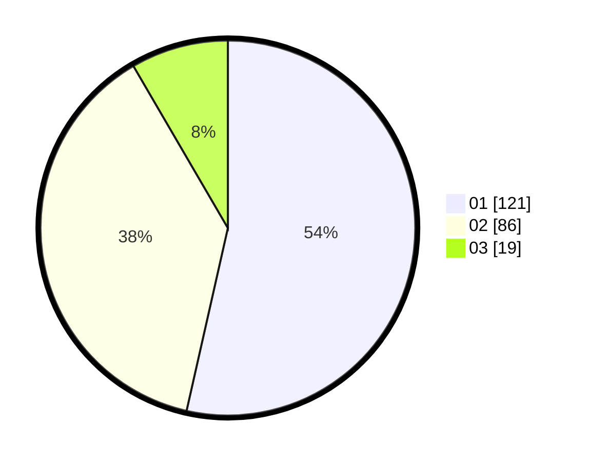

# Hasil

Hasil perolehan suara paslon dapat dilihat pada file paslon-01.txt, paslon-02.txt, dan paslon-03.txt.

Jika tidak ada, artinya data tersebut belum ada pada SIREKAP.

## Perolehan Suara

 * Paslon 01: **121**.
 * Paslon 02: **86**.
 * Paslon 03: **19**.

## Foto C Plano

https://sirekap-obj-formc.kpu.go.id/b82f/pemilu/ppwp/31/75/07/10/04/3175071004028-20240214-214210--78840347-713a-41ba-a850-3d6795617e38.jpg

https://sirekap-obj-formc.kpu.go.id/b82f/pemilu/ppwp/31/75/07/10/04/3175071004028-20240214-214000--53923cbf-1d6b-442e-82a6-da6a09b2269a.jpg

https://sirekap-obj-formc.kpu.go.id/b82f/pemilu/ppwp/31/75/07/10/04/3175071004028-20240214-213924--a7992598-e0bd-40af-be7c-6b076a4f2a69.jpg

## DATA PEMILIH TETAP

Jumlah pemilih dalam DPT: **278**.
 * L: **141**.
 * P: **137**.

## DATA PENGGUNA HAK PILIH

Jumlah pengguna hak pilih dalam DPT: **229**.
 * L: **90**.
 * P: **139**.

Jumlah pengguna hak pilih dalam DPTb: **10**.
 * L: **5**.
 * P: **5**.

Jumlah pengguna hak pilih dalam DPK: **1**.
 * L: **1**.
 * P: **0**.

Jumlah pengguna hak pilih: **240**.
 * L: **96**.
 * P: **144**.

## JUMLAH SUARA SAH DAN TIDAK SAH

JUMLAH SELURUH SUARA SAH: **226**.

JUMLAH SUARA TIDAK SAH: **3**.

JUMLAH SELURUH SUARA SAH DAN SUARA TIDAK SAH: **229**.
