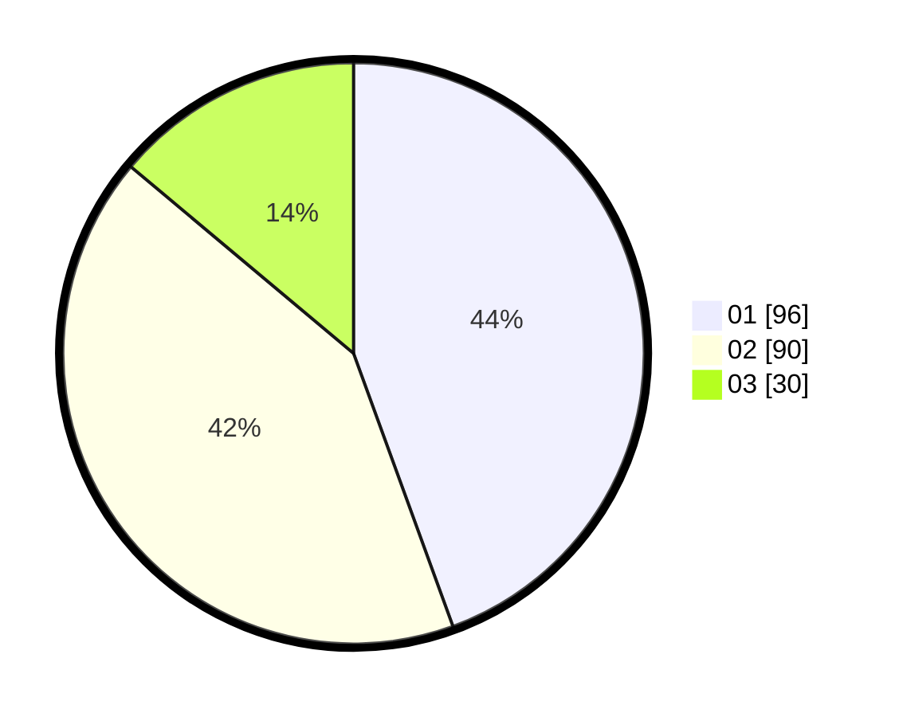

# Hasil

Hasil perolehan suara paslon dapat dilihat pada file paslon-01.txt, paslon-02.txt, dan paslon-03.txt.

Jika tidak ada, artinya data tersebut belum ada pada SIREKAP.

## Perolehan Suara

 * Paslon 01: **96**.
 * Paslon 02: **90**.
 * Paslon 03: **30**.

## Foto C Plano

https://sirekap-obj-formc.kpu.go.id/bf4e/pemilu/ppwp/31/75/07/10/04/3175071004031-20240214-212804--a16abfa8-b66c-46dd-92eb-3123e43b3219.jpg

https://sirekap-obj-formc.kpu.go.id/bf4e/pemilu/ppwp/31/75/07/10/04/3175071004031-20240214-204410--01119aa4-8898-4ae7-a65a-37223ebb4610.jpg

https://sirekap-obj-formc.kpu.go.id/bf4e/pemilu/ppwp/31/75/07/10/04/3175071004031-20240214-204304--716b7f51-d5f5-4547-bb81-1112a9e1fdc4.jpg
