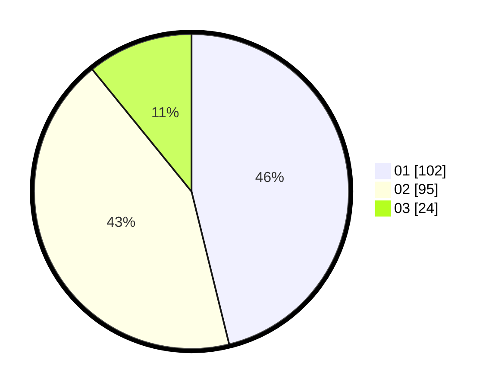

# Hasil

Hasil perolehan suara paslon dapat dilihat pada file paslon-01.txt, paslon-02.txt, dan paslon-03.txt.

Jika tidak ada, artinya data tersebut belum ada pada SIREKAP.

## Perolehan Suara

 * Paslon 01: **102**.
 * Paslon 02: **95**.
 * Paslon 03: **24**.

## Foto C Plano

https://sirekap-obj-formc.kpu.go.id/7211/pemilu/ppwp/31/75/07/10/04/3175071004034-20240214-221447--26d49672-1df2-4036-9ff4-6f44b5fb06df.jpg

https://sirekap-obj-formc.kpu.go.id/7211/pemilu/ppwp/31/75/07/10/04/3175071004034-20240214-221149--29ba77e2-dc45-4ff8-b5c4-38cb912f0ce5.jpg

https://sirekap-obj-formc.kpu.go.id/7211/pemilu/ppwp/31/75/07/10/04/3175071004034-20240214-221537--0a440230-7e1a-4068-a7bf-2c0d492571d7.jpg

## DATA PEMILIH TETAP

Jumlah pemilih dalam DPT: **271**.
 * L: **135**.
 * P: **136**.

## DATA PENGGUNA HAK PILIH

Jumlah pengguna hak pilih dalam DPT: **218**.
 * L: **100**.
 * P: **118**.

Jumlah pengguna hak pilih dalam DPTb: **3**.
 * L: **1**.
 * P: **2**.

Jumlah pengguna hak pilih dalam DPK: **1**.
 * L: **1**.
 * P: **0**.

Jumlah pengguna hak pilih: **222**.
 * L: **102**.
 * P: **120**.

## JUMLAH SUARA SAH DAN TIDAK SAH

JUMLAH SELURUH SUARA SAH: **221**.

JUMLAH SUARA TIDAK SAH: **1**.

JUMLAH SELURUH SUARA SAH DAN SUARA TIDAK SAH: **222**.
