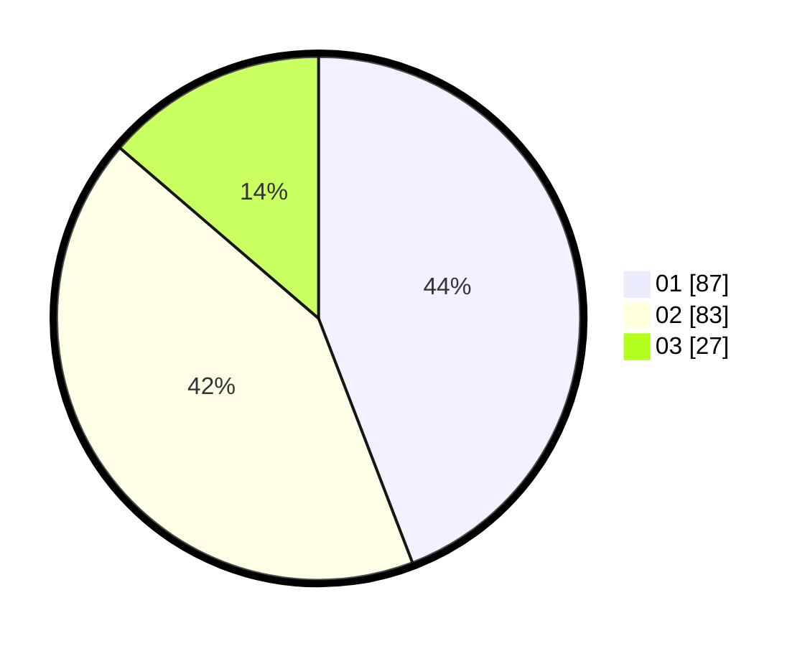

# Hasil

Hasil perolehan suara paslon dapat dilihat pada file paslon-01.txt, paslon-02.txt, dan paslon-03.txt.

Jika tidak ada, artinya data tersebut belum ada pada SIREKAP.

## Perolehan Suara

 * Paslon 01: **87**.
 * Paslon 02: **83**.
 * Paslon 03: **27**.

## Foto C Plano

https://sirekap-obj-formc.kpu.go.id/9c9b/pemilu/ppwp/31/75/07/10/04/3175071004036-20240215-212627--5ce06ab7-4698-403a-bc7d-18e9aeee07ea.jpg

https://sirekap-obj-formc.kpu.go.id/9c9b/pemilu/ppwp/31/75/07/10/04/3175071004036-20240215-212629--9d6e5efd-dc67-4d22-948a-fcf0fe96af3e.jpg

https://sirekap-obj-formc.kpu.go.id/9c9b/pemilu/ppwp/31/75/07/10/04/3175071004036-20240215-212628--df087f4c-e33b-487b-be66-cf83716f5d01.jpg

## DATA PEMILIH TETAP

Jumlah pemilih dalam DPT: **234**.
 * L: **112**.
 * P: **122**.

## DATA PENGGUNA HAK PILIH

Jumlah pengguna hak pilih dalam DPT: **198**.
 * L: **94**.
 * P: **104**.

Jumlah pengguna hak pilih dalam DPTb: **0**.
 * L: **0**.
 * P: **0**.

Jumlah pengguna hak pilih dalam DPK: **1**.
 * L: **1**.
 * P: **0**.

Jumlah pengguna hak pilih: **199**.
 * L: **95**.
 * P: **104**.

## JUMLAH SUARA SAH DAN TIDAK SAH

JUMLAH SELURUH SUARA SAH: **197**.

JUMLAH SUARA TIDAK SAH: **2**.

JUMLAH SELURUH SUARA SAH DAN SUARA TIDAK SAH: **199**.
