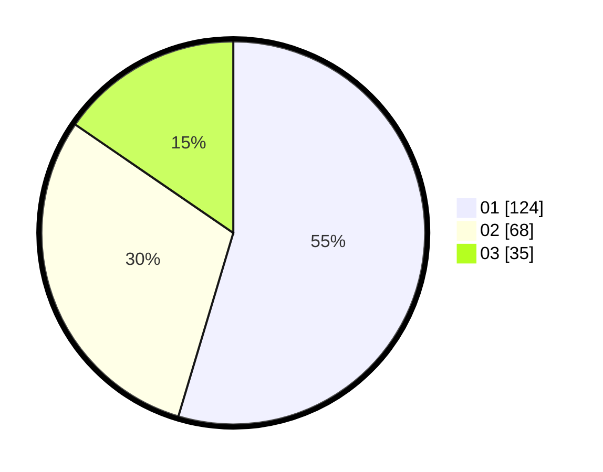

# Hasil

Hasil perolehan suara paslon dapat dilihat pada file paslon-01.txt, paslon-02.txt, dan paslon-03.txt.

Jika tidak ada, artinya data tersebut belum ada pada SIREKAP.

## Perolehan Suara

 * Paslon 01: **124**.
 * Paslon 02: **68**.
 * Paslon 03: **35**.

## Foto C Plano

https://sirekap-obj-formc.kpu.go.id/7d75/pemilu/ppwp/31/75/07/10/04/3175071004039-20240214-201910--16c4235c-496b-4727-a4fd-b350e67e1c0c.jpg

https://sirekap-obj-formc.kpu.go.id/7d75/pemilu/ppwp/31/75/07/10/04/3175071004039-20240214-191748--aa8b795f-78e5-4927-bdf8-c5fad327ec2f.jpg
