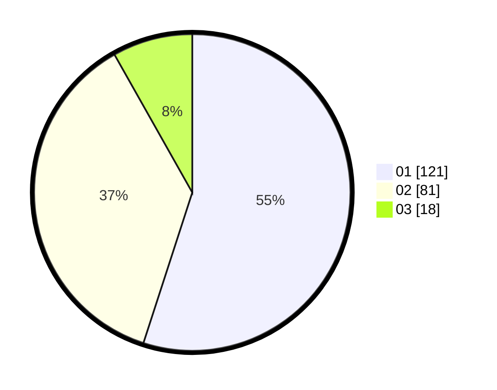

# Hasil

Hasil perolehan suara paslon dapat dilihat pada file paslon-01.txt, paslon-02.txt, dan paslon-03.txt.

Jika tidak ada, artinya data tersebut belum ada pada SIREKAP.

## Perolehan Suara

 * Paslon 01: **121**.
 * Paslon 02: **81**.
 * Paslon 03: **18**.

## Foto C Plano

https://sirekap-obj-formc.kpu.go.id/8d80/pemilu/ppwp/31/75/07/10/04/3175071004043-20240214-224129--7719ae0c-25a4-4cbc-bf8b-2bfc96224cae.jpg

https://sirekap-obj-formc.kpu.go.id/8d80/pemilu/ppwp/31/75/07/10/04/3175071004043-20240214-203803--6b4602b3-11e0-4422-9a4f-2b365c99a1dc.jpg

https://sirekap-obj-formc.kpu.go.id/8d80/pemilu/ppwp/31/75/07/10/04/3175071004043-20240214-204115--3c47f93a-f053-4e02-9975-eb95af29cd7f.jpg
