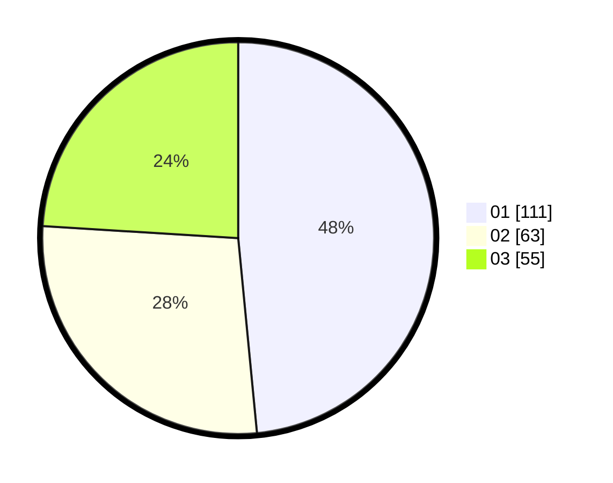

# Hasil

Hasil perolehan suara paslon dapat dilihat pada file paslon-01.txt, paslon-02.txt, dan paslon-03.txt.

Jika tidak ada, artinya data tersebut belum ada pada SIREKAP.

## Perolehan Suara

 * Paslon 01: **111**.
 * Paslon 02: **63**.
 * Paslon 03: **55**.

## Foto C Plano

https://sirekap-obj-formc.kpu.go.id/c537/pemilu/ppwp/31/75/07/10/04/3175071004049-20240216-004510--4e712d66-5d8a-41c4-8509-336157cf0190.jpg

https://sirekap-obj-formc.kpu.go.id/c537/pemilu/ppwp/31/75/07/10/04/3175071004049-20240216-004516--eca03cc9-1939-4b8f-8e59-ebce75bac1ec.jpg

https://sirekap-obj-formc.kpu.go.id/c537/pemilu/ppwp/31/75/07/10/04/3175071004049-20240216-004512--a3bd864b-8717-4487-a098-629c3b4bc9fe.jpg

## DATA PEMILIH TETAP

Jumlah pemilih dalam DPT: **265**.
 * L: **129**.
 * P: **136**.

## DATA PENGGUNA HAK PILIH

Jumlah pengguna hak pilih dalam DPT: **225**.
 * L: **108**.
 * P: **117**.

Jumlah pengguna hak pilih dalam DPTb: **1**.
 * L: **0**.
 * P: **1**.

Jumlah pengguna hak pilih dalam DPK: **8**.
 * L: **4**.
 * P: **4**.

Jumlah pengguna hak pilih: **234**.
 * L: **112**.
 * P: **122**.

## JUMLAH SUARA SAH DAN TIDAK SAH

JUMLAH SELURUH SUARA SAH: **229**.

JUMLAH SUARA TIDAK SAH: **5**.

JUMLAH SELURUH SUARA SAH DAN SUARA TIDAK SAH: **234**.
