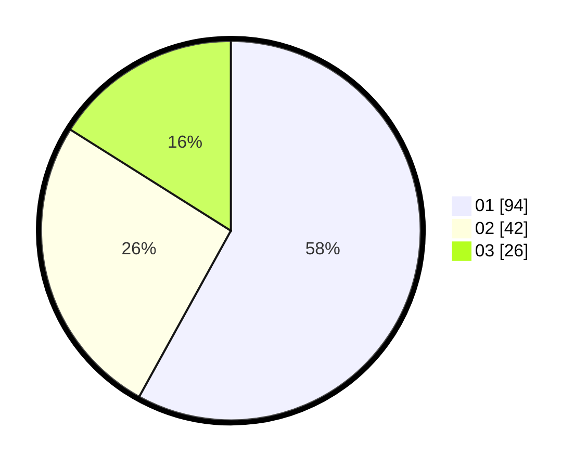

# Hasil

Hasil perolehan suara paslon dapat dilihat pada file paslon-01.txt, paslon-02.txt, dan paslon-03.txt.

Jika tidak ada, artinya data tersebut belum ada pada SIREKAP.

## Perolehan Suara

 * Paslon 01: **94**.
 * Paslon 02: **42**.
 * Paslon 03: **26**.

## Foto C Plano

https://sirekap-obj-formc.kpu.go.id/161a/pemilu/ppwp/31/75/07/10/04/3175071004057-20240214-155124--a40e34aa-0ca2-4a67-ae08-5b81fd23b10b.jpg

https://sirekap-obj-formc.kpu.go.id/161a/pemilu/ppwp/31/75/07/10/04/3175071004057-20240214-155130--9e22d149-6f41-44c5-9e52-94382127d534.jpg

https://sirekap-obj-formc.kpu.go.id/161a/pemilu/ppwp/31/75/07/10/04/3175071004057-20240214-155134--586a76e8-5128-40bb-979f-a02e4436b71b.jpg

## DATA PEMILIH TETAP

Jumlah pemilih dalam DPT: **203**.
 * L: **100**.
 * P: **103**.

## DATA PENGGUNA HAK PILIH

Jumlah pengguna hak pilih dalam DPT: **162**.
 * L: **77**.
 * P: **85**.

Jumlah pengguna hak pilih dalam DPTb: **1**.
 * L: **0**.
 * P: **1**.

Jumlah pengguna hak pilih dalam DPK: **2**.
 * L: **0**.
 * P: **2**.

Jumlah pengguna hak pilih: **165**.
 * L: **77**.
 * P: **88**.

## JUMLAH SUARA SAH DAN TIDAK SAH

JUMLAH SELURUH SUARA SAH: **162**.

JUMLAH SUARA TIDAK SAH: **3**.

JUMLAH SELURUH SUARA SAH DAN SUARA TIDAK SAH: **165**.
