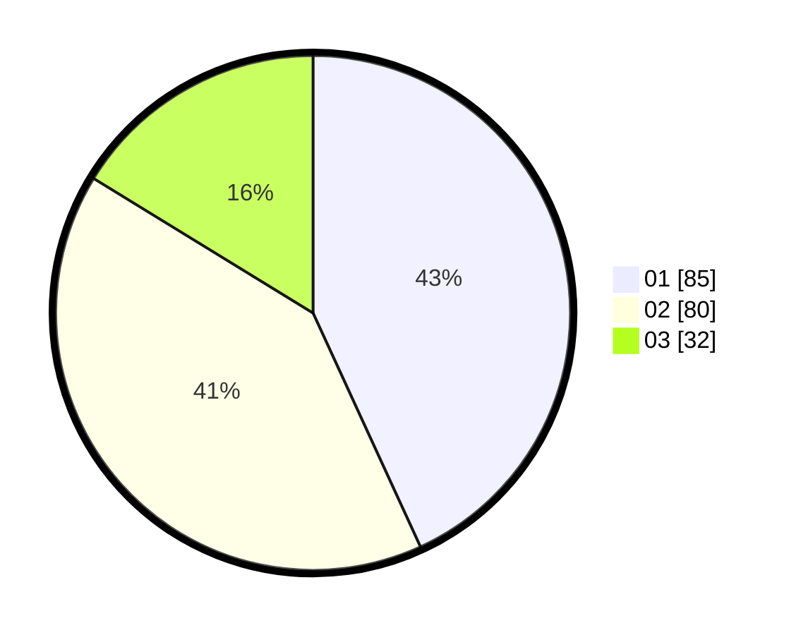

# Hasil

Hasil perolehan suara paslon dapat dilihat pada file paslon-01.txt, paslon-02.txt, dan paslon-03.txt.

Jika tidak ada, artinya data tersebut belum ada pada SIREKAP.

## Perolehan Suara

 * Paslon 01: **85**.
 * Paslon 02: **80**.
 * Paslon 03: **32**.

## Foto C Plano

https://sirekap-obj-formc.kpu.go.id/def0/pemilu/ppwp/31/75/07/10/04/3175071004061-20240214-215857--ee1dbef8-dcb3-402a-a848-fd165fdb759c.jpg

https://sirekap-obj-formc.kpu.go.id/def0/pemilu/ppwp/31/75/07/10/04/3175071004061-20240214-221008--0056ecbd-afd2-4777-b350-f3195b39a788.jpg

https://sirekap-obj-formc.kpu.go.id/def0/pemilu/ppwp/31/75/07/10/04/3175071004061-20240214-221011--a319f324-d319-4510-9c3e-fc8586e5d937.jpg

## DATA PEMILIH TETAP

Jumlah pemilih dalam DPT: **200**.
 * L: **88**.
 * P: **112**.

## DATA PENGGUNA HAK PILIH

Jumlah pengguna hak pilih dalam DPT: **200**.
 * L: **88**.
 * P: **112**.

Jumlah pengguna hak pilih dalam DPTb: **0**.
 * L: **0**.
 * P: **0**.

Jumlah pengguna hak pilih dalam DPK: **0**.
 * L: **0**.
 * P: **0**.

Jumlah pengguna hak pilih: **200**.
 * L: **88**.
 * P: **112**.

## JUMLAH SUARA SAH DAN TIDAK SAH

JUMLAH SELURUH SUARA SAH: **197**.

JUMLAH SUARA TIDAK SAH: **3**.

JUMLAH SELURUH SUARA SAH DAN SUARA TIDAK SAH: **200**.
