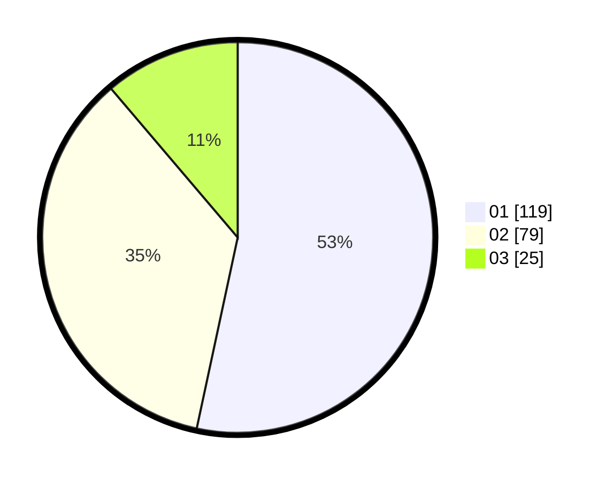

# Hasil

Hasil perolehan suara paslon dapat dilihat pada file paslon-01.txt, paslon-02.txt, dan paslon-03.txt.

Jika tidak ada, artinya data tersebut belum ada pada SIREKAP.

## Perolehan Suara

 * Paslon 01: **119**.
 * Paslon 02: **79**.
 * Paslon 03: **25**.

## Foto C Plano

https://sirekap-obj-formc.kpu.go.id/e6ba/pemilu/ppwp/31/75/07/10/04/3175071004062-20240216-013856--b8d8f4fe-58d5-4e3b-a730-f0841bb5eb14.jpg

https://sirekap-obj-formc.kpu.go.id/e6ba/pemilu/ppwp/31/75/07/10/04/3175071004062-20240216-013859--c2504d8a-9ccf-431a-b75c-e35d1273b7d4.jpg

https://sirekap-obj-formc.kpu.go.id/e6ba/pemilu/ppwp/31/75/07/10/04/3175071004062-20240216-013856--3df53132-8a38-4fab-8dc5-324be99d5a97.jpg

## DATA PEMILIH TETAP

Jumlah pemilih dalam DPT: **263**.
 * L: **139**.
 * P: **124**.

## DATA PENGGUNA HAK PILIH

Jumlah pengguna hak pilih dalam DPT: **220**.
 * L: **116**.
 * P: **104**.

Jumlah pengguna hak pilih dalam DPTb: **0**.
 * L: **0**.
 * P: **0**.

Jumlah pengguna hak pilih dalam DPK: **1**.
 * L: **0**.
 * P: **1**.

Jumlah pengguna hak pilih: **221**.
 * L: **116**.
 * P: **105**.

## JUMLAH SUARA SAH DAN TIDAK SAH

JUMLAH SELURUH SUARA SAH: **223**.

JUMLAH SUARA TIDAK SAH: **0**.

JUMLAH SELURUH SUARA SAH DAN SUARA TIDAK SAH: **223**.
