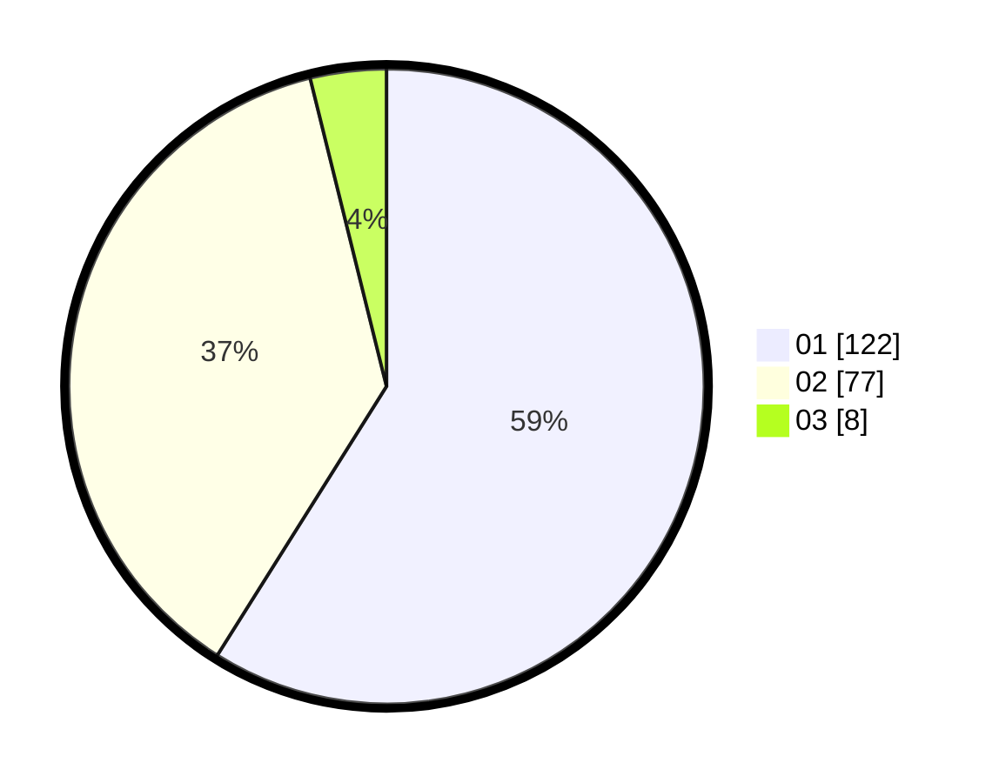

# Hasil

Hasil perolehan suara paslon dapat dilihat pada file paslon-01.txt, paslon-02.txt, dan paslon-03.txt.

Jika tidak ada, artinya data tersebut belum ada pada SIREKAP.

## Perolehan Suara

 * Paslon 01: **122**.
 * Paslon 02: **77**.
 * Paslon 03: **8**.

## Foto C Plano

https://sirekap-obj-formc.kpu.go.id/e7a6/pemilu/ppwp/31/75/07/10/04/3175071004065-20240215-105232--ec588eac-c44b-4ca9-bf18-f6c8cae10374.jpg

https://sirekap-obj-formc.kpu.go.id/e7a6/pemilu/ppwp/31/75/07/10/04/3175071004065-20240214-155118--80bdcf36-23df-4cf9-baae-9813964af068.jpg

https://sirekap-obj-formc.kpu.go.id/e7a6/pemilu/ppwp/31/75/07/10/04/3175071004065-20240214-155135--cc33dedf-7fa4-497f-97e3-ed9b2a1d7982.jpg

## DATA PEMILIH TETAP

Jumlah pemilih dalam DPT: **0**.
 * L: **0**.
 * P: **0**.

## DATA PENGGUNA HAK PILIH

Jumlah pengguna hak pilih dalam DPT: **0**.
 * L: **0**.
 * P: **0**.

Jumlah pengguna hak pilih dalam DPTb: **0**.
 * L: **0**.
 * P: **0**.

Jumlah pengguna hak pilih dalam DPK: **0**.
 * L: **0**.
 * P: **0**.

Jumlah pengguna hak pilih: **0**.
 * L: **0**.
 * P: **0**.

## JUMLAH SUARA SAH DAN TIDAK SAH

JUMLAH SELURUH SUARA SAH: **207**.

JUMLAH SUARA TIDAK SAH: **5**.

JUMLAH SELURUH SUARA SAH DAN SUARA TIDAK SAH: **212**.
