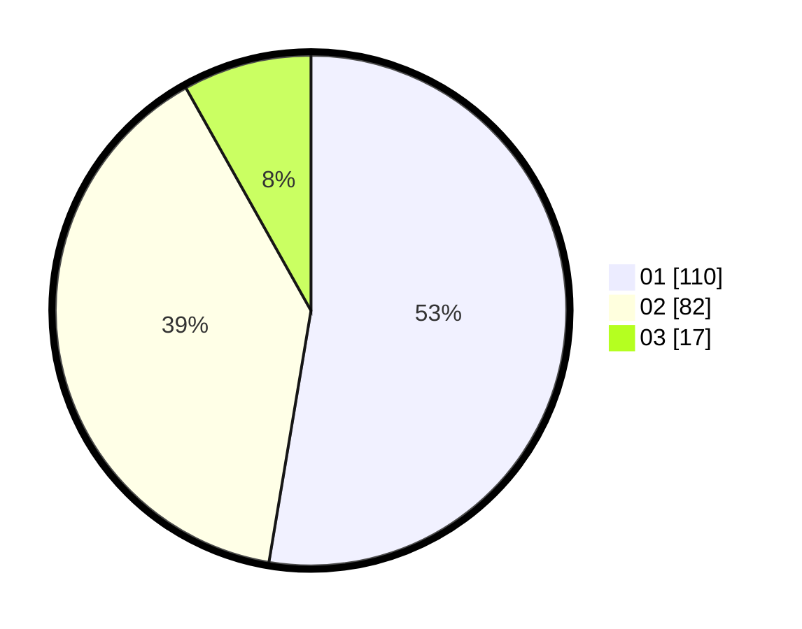

# Hasil

Hasil perolehan suara paslon dapat dilihat pada file paslon-01.txt, paslon-02.txt, dan paslon-03.txt.

Jika tidak ada, artinya data tersebut belum ada pada SIREKAP.

## Perolehan Suara

 * Paslon 01: **110**.
 * Paslon 02: **82**.
 * Paslon 03: **17**.

## Foto C Plano

https://sirekap-obj-formc.kpu.go.id/a49f/pemilu/ppwp/31/75/07/10/04/3175071004068-20240214-194209--0a99d04e-38ac-4fe1-b163-1a165c0cc902.jpg

https://sirekap-obj-formc.kpu.go.id/a49f/pemilu/ppwp/31/75/07/10/04/3175071004068-20240214-194223--8ec33fd8-6752-4fe0-8100-d4c702973c5b.jpg

https://sirekap-obj-formc.kpu.go.id/a49f/pemilu/ppwp/31/75/07/10/04/3175071004068-20240214-194240--9b947847-600f-4313-940e-b891f3a9b2dc.jpg

## DATA PEMILIH TETAP

Jumlah pemilih dalam DPT: **256**.
 * L: **113**.
 * P: **143**.

## DATA PENGGUNA HAK PILIH

Jumlah pengguna hak pilih dalam DPT: **204**.
 * L: **94**.
 * P: **110**.

Jumlah pengguna hak pilih dalam DPTb: **1**.
 * L: **1**.
 * P: **0**.

Jumlah pengguna hak pilih dalam DPK: **6**.
 * L: **4**.
 * P: **2**.

Jumlah pengguna hak pilih: **211**.
 * L: **99**.
 * P: **112**.

## JUMLAH SUARA SAH DAN TIDAK SAH

JUMLAH SELURUH SUARA SAH: **209**.

JUMLAH SUARA TIDAK SAH: **2**.

JUMLAH SELURUH SUARA SAH DAN SUARA TIDAK SAH: **211**.
