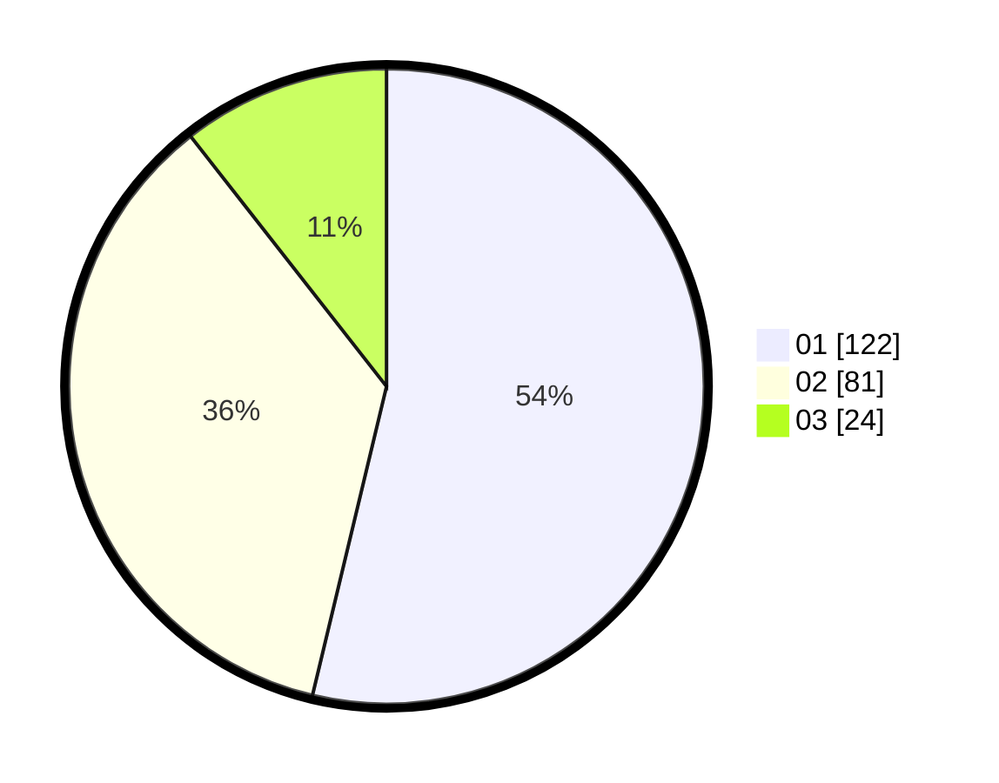

# Hasil

Hasil perolehan suara paslon dapat dilihat pada file paslon-01.txt, paslon-02.txt, dan paslon-03.txt.

Jika tidak ada, artinya data tersebut belum ada pada SIREKAP.

## Perolehan Suara

 * Paslon 01: **122**.
 * Paslon 02: **81**.
 * Paslon 03: **24**.

## Foto C Plano

https://sirekap-obj-formc.kpu.go.id/6554/pemilu/ppwp/31/75/07/10/04/3175071004069-20240214-221656--d4ec13c9-7219-43e5-8f25-77dd24f87ad3.jpg

https://sirekap-obj-formc.kpu.go.id/6554/pemilu/ppwp/31/75/07/10/04/3175071004069-20240215-203529--77e2f23c-956c-46f4-b553-bfa55bc2fbff.jpg

https://sirekap-obj-formc.kpu.go.id/6554/pemilu/ppwp/31/75/07/10/04/3175071004069-20240214-221845--9bd35674-24d7-44c8-bac6-9509007d97f0.jpg

## DATA PEMILIH TETAP

Jumlah pemilih dalam DPT: **254**.
 * L: **130**.
 * P: **124**.

## DATA PENGGUNA HAK PILIH

Jumlah pengguna hak pilih dalam DPT: **223**.
 * L: **115**.
 * P: **108**.

Jumlah pengguna hak pilih dalam DPTb: **2**.
 * L: **1**.
 * P: **1**.

Jumlah pengguna hak pilih dalam DPK: **2**.
 * L: **1**.
 * P: **1**.

Jumlah pengguna hak pilih: **227**.
 * L: **117**.
 * P: **110**.

## JUMLAH SUARA SAH DAN TIDAK SAH

JUMLAH SELURUH SUARA SAH: **227**.

JUMLAH SUARA TIDAK SAH: **0**.

JUMLAH SELURUH SUARA SAH DAN SUARA TIDAK SAH: **227**.
