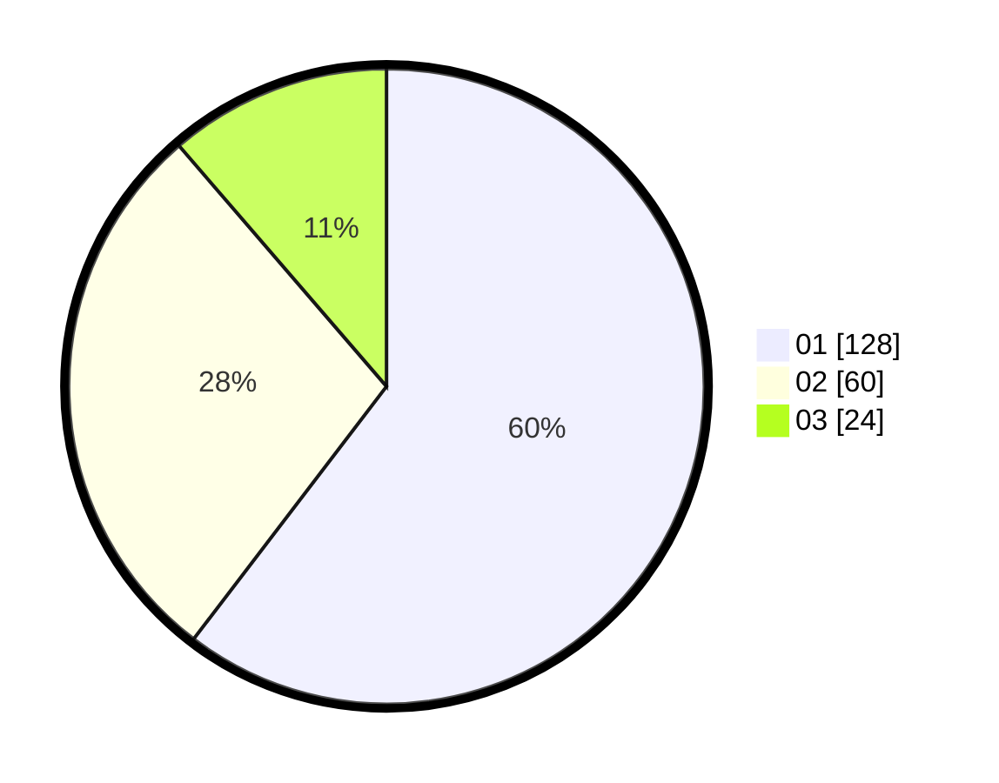

# Hasil

Hasil perolehan suara paslon dapat dilihat pada file paslon-01.txt, paslon-02.txt, dan paslon-03.txt.

Jika tidak ada, artinya data tersebut belum ada pada SIREKAP.

## Perolehan Suara

 * Paslon 01: **128**.
 * Paslon 02: **60**.
 * Paslon 03: **24**.

## Foto C Plano

https://sirekap-obj-formc.kpu.go.id/259e/pemilu/ppwp/31/75/07/10/04/3175071004072-20240214-191758--054e4802-24c5-4631-ae63-7f6463af17af.jpg

https://sirekap-obj-formc.kpu.go.id/259e/pemilu/ppwp/31/75/07/10/04/3175071004072-20240214-193946--bca2458c-3b7f-4a06-8bb4-f17180f79f7e.jpg

https://sirekap-obj-formc.kpu.go.id/259e/pemilu/ppwp/31/75/07/10/04/3175071004072-20240214-191809--9df1f217-860f-4053-8857-778af277f30f.jpg

## DATA PEMILIH TETAP

Jumlah pemilih dalam DPT: **252**.
 * L: **120**.
 * P: **132**.

## DATA PENGGUNA HAK PILIH

Jumlah pengguna hak pilih dalam DPT: **209**.
 * L: **96**.
 * P: **113**.

Jumlah pengguna hak pilih dalam DPTb: **4**.
 * L: **2**.
 * P: **2**.

Jumlah pengguna hak pilih dalam DPK: **2**.
 * L: **1**.
 * P: **1**.

Jumlah pengguna hak pilih: **215**.
 * L: **99**.
 * P: **116**.

## JUMLAH SUARA SAH DAN TIDAK SAH

JUMLAH SELURUH SUARA SAH: **212**.

JUMLAH SUARA TIDAK SAH: **3**.

JUMLAH SELURUH SUARA SAH DAN SUARA TIDAK SAH: **215**.
