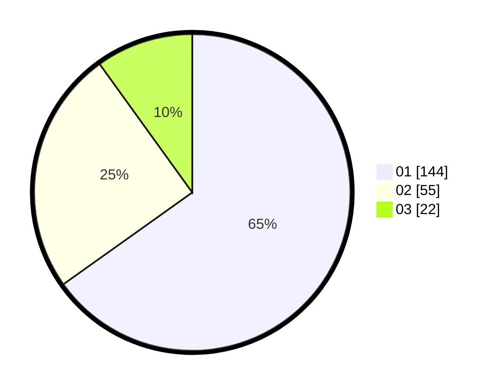

# Hasil

Hasil perolehan suara paslon dapat dilihat pada file paslon-01.txt, paslon-02.txt, dan paslon-03.txt.

Jika tidak ada, artinya data tersebut belum ada pada SIREKAP.

## Perolehan Suara

 * Paslon 01: **144**.
 * Paslon 02: **55**.
 * Paslon 03: **22**.

## Foto C Plano

https://sirekap-obj-formc.kpu.go.id/ffc8/pemilu/ppwp/31/75/07/10/04/3175071004073-20240214-190559--93a932e4-f0f2-4fbb-b777-0e2666d3a8af.jpg

https://sirekap-obj-formc.kpu.go.id/ffc8/pemilu/ppwp/31/75/07/10/04/3175071004073-20240214-195614--92ecb8ec-f3b6-48e6-82b4-7f8443b9db2d.jpg

https://sirekap-obj-formc.kpu.go.id/ffc8/pemilu/ppwp/31/75/07/10/04/3175071004073-20240214-190654--40bf3ee8-0e4a-4f8e-ba94-64858aafb163.jpg

## DATA PEMILIH TETAP

Jumlah pemilih dalam DPT: **259**.
 * L: **126**.
 * P: **133**.

## DATA PENGGUNA HAK PILIH

Jumlah pengguna hak pilih dalam DPT: **217**.
 * L: **103**.
 * P: **114**.

Jumlah pengguna hak pilih dalam DPTb: **1**.
 * L: **0**.
 * P: **1**.

Jumlah pengguna hak pilih dalam DPK: **3**.
 * L: **1**.
 * P: **2**.

Jumlah pengguna hak pilih: **221**.
 * L: **104**.
 * P: **117**.

## JUMLAH SUARA SAH DAN TIDAK SAH

JUMLAH SELURUH SUARA SAH: **221**.

JUMLAH SUARA TIDAK SAH: **0**.

JUMLAH SELURUH SUARA SAH DAN SUARA TIDAK SAH: **221**.
