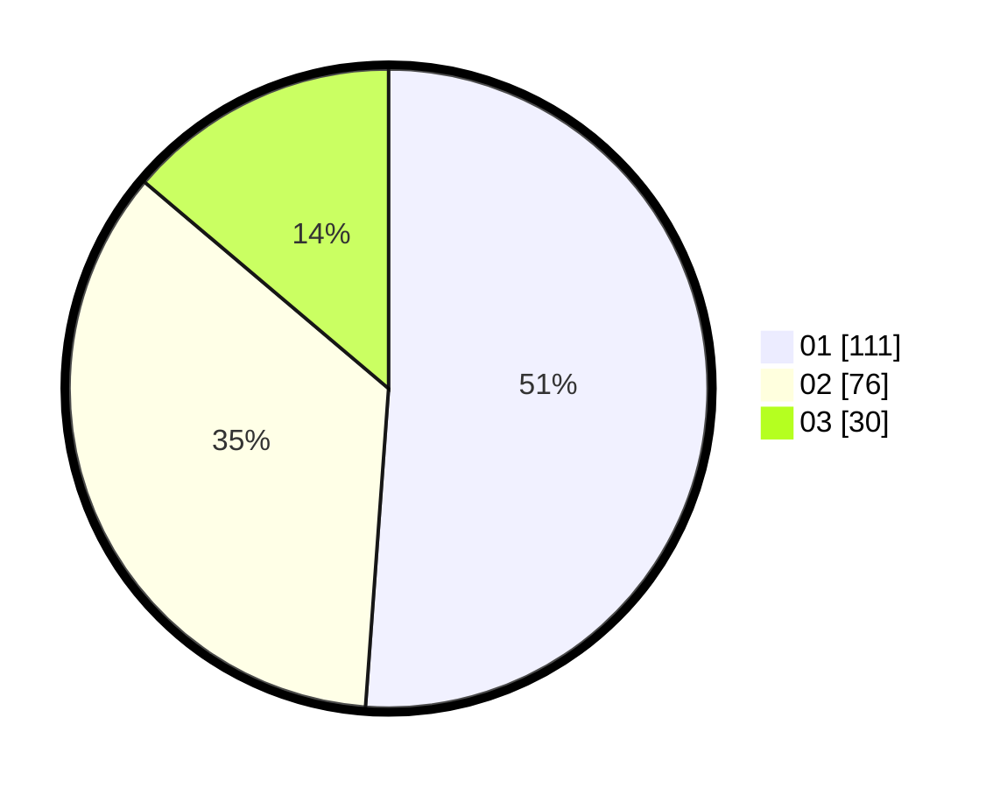

# Hasil

Hasil perolehan suara paslon dapat dilihat pada file paslon-01.txt, paslon-02.txt, dan paslon-03.txt.

Jika tidak ada, artinya data tersebut belum ada pada SIREKAP.

## Perolehan Suara

 * Paslon 01: **111**.
 * Paslon 02: **76**.
 * Paslon 03: **30**.

## Foto C Plano

https://sirekap-obj-formc.kpu.go.id/8e2a/pemilu/ppwp/31/75/07/10/04/3175071004074-20240215-004529--e9c22eca-4095-4171-a752-fc0313175f71.jpg

https://sirekap-obj-formc.kpu.go.id/8e2a/pemilu/ppwp/31/75/07/10/04/3175071004074-20240215-004607--097cef30-ff7e-49f7-9b1e-a5ab8c1a240f.jpg

https://sirekap-obj-formc.kpu.go.id/8e2a/pemilu/ppwp/31/75/07/10/04/3175071004074-20240215-004654--ba4de25e-3ee4-4e19-9ba8-fd6766b6b0f0.jpg

## DATA PEMILIH TETAP

Jumlah pemilih dalam DPT: **263**.
 * L: **121**.
 * P: **142**.

## DATA PENGGUNA HAK PILIH

Jumlah pengguna hak pilih dalam DPT: **216**.
 * L: **110**.
 * P: **106**.

Jumlah pengguna hak pilih dalam DPTb: **5**.
 * L: **3**.
 * P: **2**.

Jumlah pengguna hak pilih dalam DPK: **1**.
 * L: **1**.
 * P: **0**.

Jumlah pengguna hak pilih: **222**.
 * L: **114**.
 * P: **108**.

## JUMLAH SUARA SAH DAN TIDAK SAH

JUMLAH SELURUH SUARA SAH: **217**.

JUMLAH SUARA TIDAK SAH: **5**.

JUMLAH SELURUH SUARA SAH DAN SUARA TIDAK SAH: **222**.
