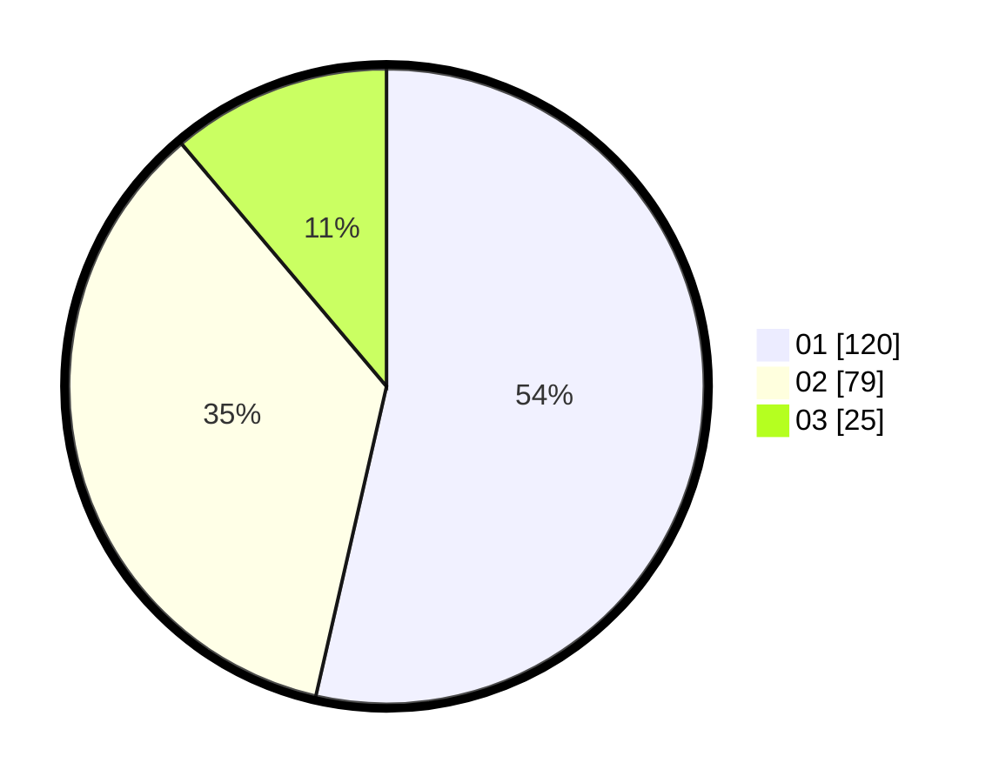

# Hasil

Hasil perolehan suara paslon dapat dilihat pada file paslon-01.txt, paslon-02.txt, dan paslon-03.txt.

Jika tidak ada, artinya data tersebut belum ada pada SIREKAP.

## Perolehan Suara

 * Paslon 01: **120**.
 * Paslon 02: **79**.
 * Paslon 03: **25**.

## Foto C Plano

https://sirekap-obj-formc.kpu.go.id/2cc7/pemilu/ppwp/31/75/07/10/04/3175071004078-20240214-194528--3c7a3188-5d69-4921-bf14-c6743188224c.jpg

https://sirekap-obj-formc.kpu.go.id/2cc7/pemilu/ppwp/31/75/07/10/04/3175071004078-20240214-200329--303fded6-075b-487f-ba38-8822eb893c1a.jpg

https://sirekap-obj-formc.kpu.go.id/2cc7/pemilu/ppwp/31/75/07/10/04/3175071004078-20240214-202153--5f949ce9-d697-4a53-a22e-c41075537891.jpg

## DATA PEMILIH TETAP

Jumlah pemilih dalam DPT: **278**.
 * L: **140**.
 * P: **138**.

## DATA PENGGUNA HAK PILIH

Jumlah pengguna hak pilih dalam DPT: **227**.
 * L: **110**.
 * P: **117**.

Jumlah pengguna hak pilih dalam DPTb: **0**.
 * L: **0**.
 * P: **0**.

Jumlah pengguna hak pilih dalam DPK: **0**.
 * L: **0**.
 * P: **0**.

Jumlah pengguna hak pilih: **227**.
 * L: **110**.
 * P: **117**.

## JUMLAH SUARA SAH DAN TIDAK SAH

JUMLAH SELURUH SUARA SAH: **224**.

JUMLAH SUARA TIDAK SAH: **3**.

JUMLAH SELURUH SUARA SAH DAN SUARA TIDAK SAH: **227**.
