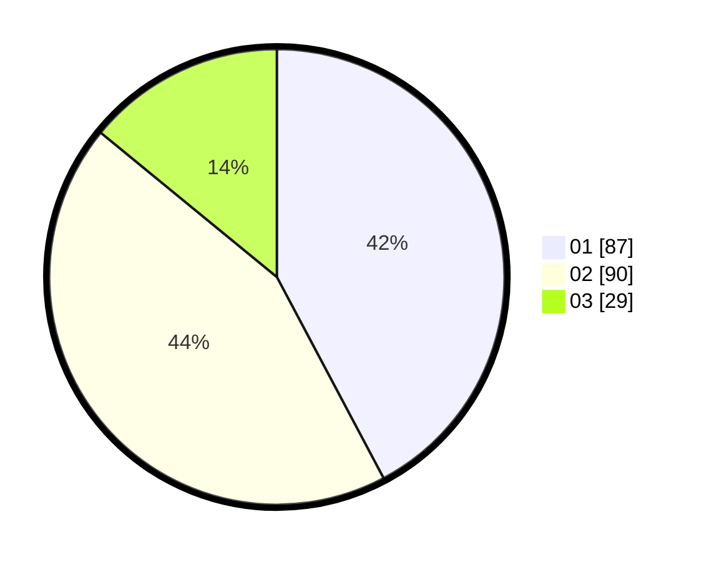

# Hasil

Hasil perolehan suara paslon dapat dilihat pada file paslon-01.txt, paslon-02.txt, dan paslon-03.txt.

Jika tidak ada, artinya data tersebut belum ada pada SIREKAP.

## Perolehan Suara

 * Paslon 01: **87**.
 * Paslon 02: **90**.
 * Paslon 03: **29**.

## Foto C Plano

https://sirekap-obj-formc.kpu.go.id/94bd/pemilu/ppwp/31/75/07/10/04/3175071004079-20240214-155347--949b6215-2935-4390-b324-2d8da071a442.jpg

https://sirekap-obj-formc.kpu.go.id/94bd/pemilu/ppwp/31/75/07/10/04/3175071004079-20240214-155625--395903fc-208c-4d3a-bbc7-34291647408a.jpg

https://sirekap-obj-formc.kpu.go.id/94bd/pemilu/ppwp/31/75/07/10/04/3175071004079-20240214-155733--3579049b-7916-4f6c-8929-801badd3dec7.jpg

## DATA PEMILIH TETAP

Jumlah pemilih dalam DPT: **275**.
 * L: **129**.
 * P: **146**.

## DATA PENGGUNA HAK PILIH

Jumlah pengguna hak pilih dalam DPT: **205**.
 * L: **92**.
 * P: **113**.

Jumlah pengguna hak pilih dalam DPTb: **1**.
 * L: **1**.
 * P: **0**.

Jumlah pengguna hak pilih dalam DPK: **2**.
 * L: **2**.
 * P: **0**.

Jumlah pengguna hak pilih: **208**.
 * L: **95**.
 * P: **113**.

## JUMLAH SUARA SAH DAN TIDAK SAH

JUMLAH SELURUH SUARA SAH: **206**.

JUMLAH SUARA TIDAK SAH: **2**.

JUMLAH SELURUH SUARA SAH DAN SUARA TIDAK SAH: **208**.
