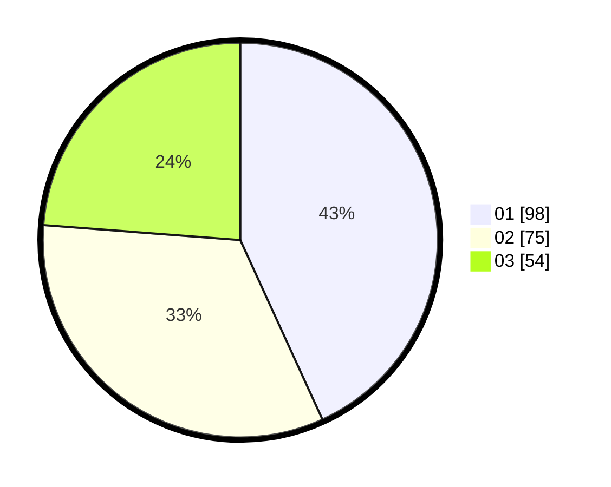

# Hasil

Hasil perolehan suara paslon dapat dilihat pada file paslon-01.txt, paslon-02.txt, dan paslon-03.txt.

Jika tidak ada, artinya data tersebut belum ada pada SIREKAP.

## Perolehan Suara

 * Paslon 01: **98**.
 * Paslon 02: **75**.
 * Paslon 03: **54**.

## Foto C Plano

https://sirekap-obj-formc.kpu.go.id/3ee0/pemilu/ppwp/31/75/07/10/04/3175071004083-20240215-015401--c3e1ccd9-248c-4ed9-ab70-c77d22d99e25.jpg

https://sirekap-obj-formc.kpu.go.id/3ee0/pemilu/ppwp/31/75/07/10/04/3175071004083-20240215-015307--00ea523b-05c4-41e8-aeb5-33343f4d635e.jpg
