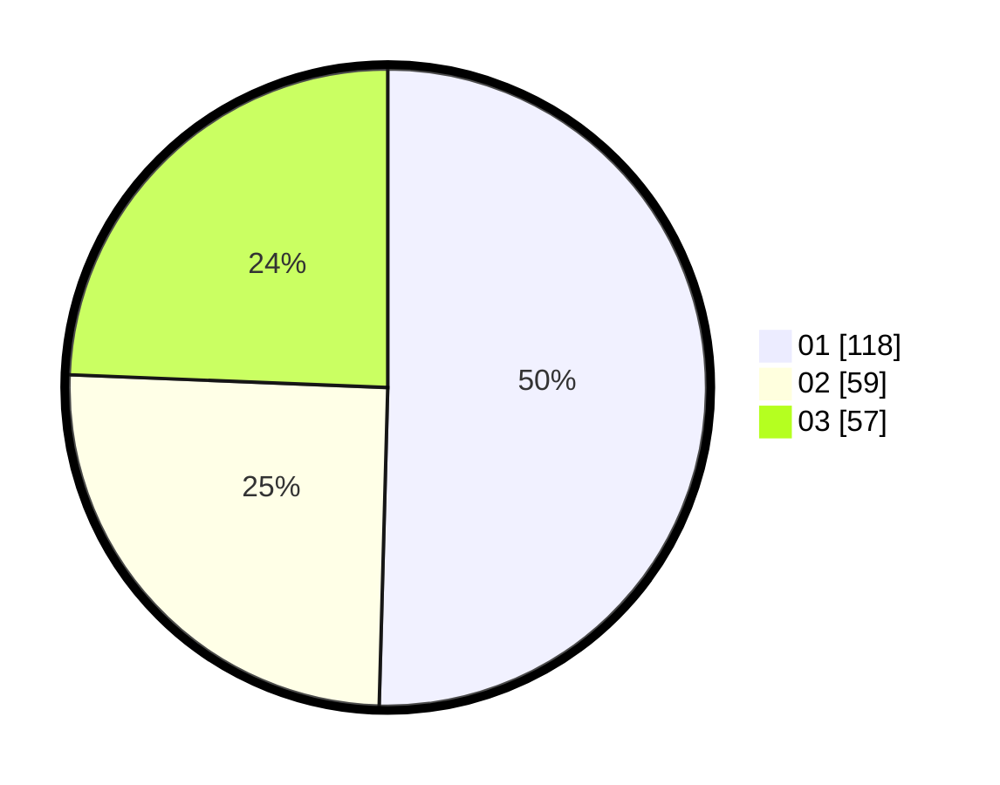

# Hasil

Hasil perolehan suara paslon dapat dilihat pada file paslon-01.txt, paslon-02.txt, dan paslon-03.txt.

Jika tidak ada, artinya data tersebut belum ada pada SIREKAP.

## Perolehan Suara

 * Paslon 01: **118**.
 * Paslon 02: **59**.
 * Paslon 03: **57**.

## Foto C Plano

https://sirekap-obj-formc.kpu.go.id/1b78/pemilu/ppwp/31/75/07/10/04/3175071004085-20240214-193215--a49f61e9-7c35-428b-8af0-d091c343c678.jpg

https://sirekap-obj-formc.kpu.go.id/1b78/pemilu/ppwp/31/75/07/10/04/3175071004085-20240214-215048--4d1f0cf8-c317-4671-a759-9e9b37880239.jpg

https://sirekap-obj-formc.kpu.go.id/1b78/pemilu/ppwp/31/75/07/10/04/3175071004085-20240214-193447--f2365e9f-699a-4bef-927f-669928b4b995.jpg

## DATA PEMILIH TETAP

Jumlah pemilih dalam DPT: **277**.
 * L: **125**.
 * P: **152**.

## DATA PENGGUNA HAK PILIH

Jumlah pengguna hak pilih dalam DPT: **230**.
 * L: **102**.
 * P: **128**.

Jumlah pengguna hak pilih dalam DPTb: **5**.
 * L: **0**.
 * P: **5**.

Jumlah pengguna hak pilih dalam DPK: **0**.
 * L: **0**.
 * P: **0**.

Jumlah pengguna hak pilih: **235**.
 * L: **102**.
 * P: **133**.

## JUMLAH SUARA SAH DAN TIDAK SAH

JUMLAH SELURUH SUARA SAH: **234**.

JUMLAH SUARA TIDAK SAH: **1**.

JUMLAH SELURUH SUARA SAH DAN SUARA TIDAK SAH: **235**.
