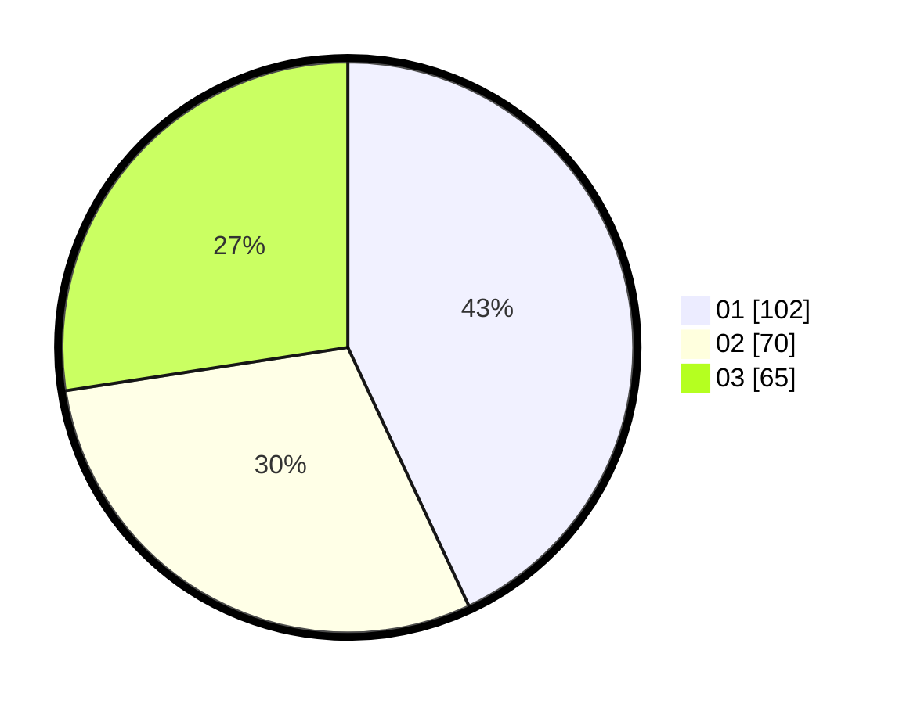

# Hasil

Hasil perolehan suara paslon dapat dilihat pada file paslon-01.txt, paslon-02.txt, dan paslon-03.txt.

Jika tidak ada, artinya data tersebut belum ada pada SIREKAP.

## Perolehan Suara

 * Paslon 01: **102**.
 * Paslon 02: **70**.
 * Paslon 03: **65**.

## Foto C Plano

https://sirekap-obj-formc.kpu.go.id/d9b0/pemilu/ppwp/31/75/07/10/04/3175071004086-20240214-185308--171405c3-e500-4451-b181-e6127a8a51c5.jpg

https://sirekap-obj-formc.kpu.go.id/d9b0/pemilu/ppwp/31/75/07/10/04/3175071004086-20240214-192050--4e281843-6af3-4e88-9ce4-c5ad587f666d.jpg

https://sirekap-obj-formc.kpu.go.id/d9b0/pemilu/ppwp/31/75/07/10/04/3175071004086-20240214-184649--54fc0a63-5eff-49ef-b23b-ce592e0126b5.jpg

## DATA PEMILIH TETAP

Jumlah pemilih dalam DPT: **283**.
 * L: **126**.
 * P: **157**.

## DATA PENGGUNA HAK PILIH

Jumlah pengguna hak pilih dalam DPT: **234**.
 * L: **101**.
 * P: **133**.

Jumlah pengguna hak pilih dalam DPTb: **2**.
 * L: **1**.
 * P: **1**.

Jumlah pengguna hak pilih dalam DPK: **6**.
 * L: **5**.
 * P: **1**.

Jumlah pengguna hak pilih: **242**.
 * L: **107**.
 * P: **135**.

## JUMLAH SUARA SAH DAN TIDAK SAH

JUMLAH SELURUH SUARA SAH: **237**.

JUMLAH SUARA TIDAK SAH: **5**.

JUMLAH SELURUH SUARA SAH DAN SUARA TIDAK SAH: **242**.
