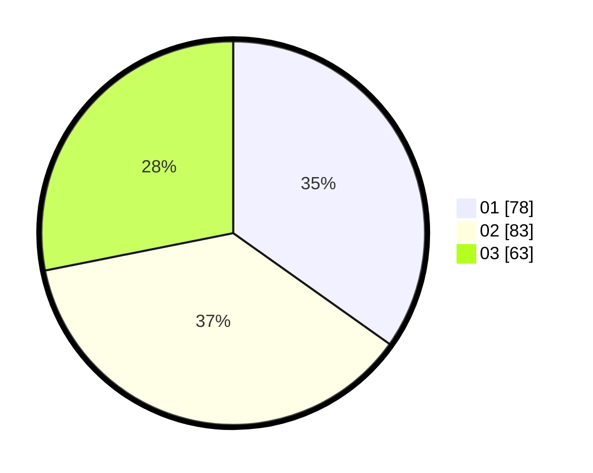

# Hasil

Hasil perolehan suara paslon dapat dilihat pada file paslon-01.txt, paslon-02.txt, dan paslon-03.txt.

Jika tidak ada, artinya data tersebut belum ada pada SIREKAP.

## Perolehan Suara

 * Paslon 01: **78**.
 * Paslon 02: **83**.
 * Paslon 03: **63**.

## Foto C Plano

https://sirekap-obj-formc.kpu.go.id/8d52/pemilu/ppwp/31/75/07/10/04/3175071004087-20240218-194642--6e17a219-5357-4e85-9d23-54f10e76dbdf.jpg

https://sirekap-obj-formc.kpu.go.id/8d52/pemilu/ppwp/31/75/07/10/04/3175071004087-20240214-224437--c5dcc0e6-ebdc-4beb-ae80-0592afc0a0c3.jpg

https://sirekap-obj-formc.kpu.go.id/8d52/pemilu/ppwp/31/75/07/10/04/3175071004087-20240218-195333--a47d857f-fb02-4cef-a33e-6ad88e9ebef3.jpg

## DATA PEMILIH TETAP

Jumlah pemilih dalam DPT: **225**.
 * L: **105**.
 * P: **120**.

## DATA PENGGUNA HAK PILIH

Jumlah pengguna hak pilih dalam DPT: **225**.
 * L: **105**.
 * P: **120**.

Jumlah pengguna hak pilih dalam DPTb: **0**.
 * L: **0**.
 * P: **0**.

Jumlah pengguna hak pilih dalam DPK: **0**.
 * L: **0**.
 * P: **0**.

Jumlah pengguna hak pilih: **0**.
 * L: **0**.
 * P: **0**.

## JUMLAH SUARA SAH DAN TIDAK SAH

JUMLAH SELURUH SUARA SAH: **224**.

JUMLAH SUARA TIDAK SAH: **1**.

JUMLAH SELURUH SUARA SAH DAN SUARA TIDAK SAH: **225**.
