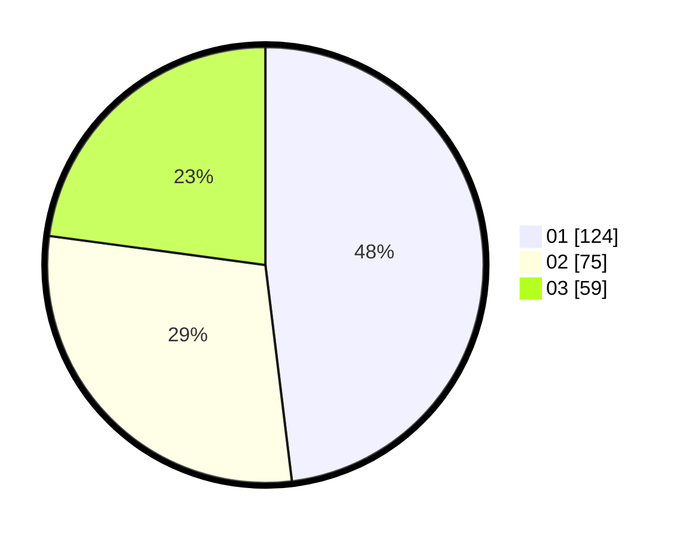

# Hasil

Hasil perolehan suara paslon dapat dilihat pada file paslon-01.txt, paslon-02.txt, dan paslon-03.txt.

Jika tidak ada, artinya data tersebut belum ada pada SIREKAP.

## Perolehan Suara

 * Paslon 01: **124**.
 * Paslon 02: **75**.
 * Paslon 03: **59**.

## Foto C Plano

https://sirekap-obj-formc.kpu.go.id/9885/pemilu/ppwp/31/75/07/10/04/3175071004088-20240216-150801--1fd451f1-7725-43dc-b6d9-31d3099ce024.jpg

https://sirekap-obj-formc.kpu.go.id/9885/pemilu/ppwp/31/75/07/10/04/3175071004088-20240216-150802--28b044c7-2a58-4d38-b499-7aa15cf32789.jpg

https://sirekap-obj-formc.kpu.go.id/9885/pemilu/ppwp/31/75/07/10/04/3175071004088-20240216-150802--cd1c4620-7c59-4d86-a3eb-46fbdcf1766e.jpg

## DATA PEMILIH TETAP

Jumlah pemilih dalam DPT: **289**.
 * L: **135**.
 * P: **154**.

## DATA PENGGUNA HAK PILIH

Jumlah pengguna hak pilih dalam DPT: **252**.
 * L: **117**.
 * P: **135**.

Jumlah pengguna hak pilih dalam DPTb: **4**.
 * L: **3**.
 * P: **1**.

Jumlah pengguna hak pilih dalam DPK: **4**.
 * L: **3**.
 * P: **1**.

Jumlah pengguna hak pilih: **260**.
 * L: **123**.
 * P: **137**.

## JUMLAH SUARA SAH DAN TIDAK SAH

JUMLAH SELURUH SUARA SAH: **258**.

JUMLAH SUARA TIDAK SAH: **2**.

JUMLAH SELURUH SUARA SAH DAN SUARA TIDAK SAH: **260**.
