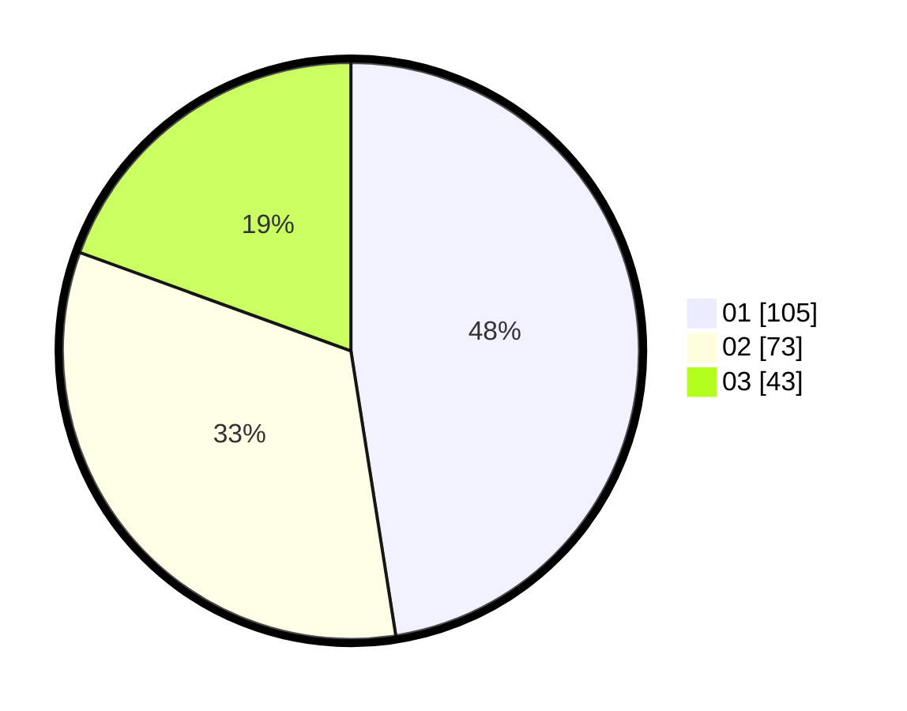

# Hasil

Hasil perolehan suara paslon dapat dilihat pada file paslon-01.txt, paslon-02.txt, dan paslon-03.txt.

Jika tidak ada, artinya data tersebut belum ada pada SIREKAP.

## Perolehan Suara

 * Paslon 01: **105**.
 * Paslon 02: **73**.
 * Paslon 03: **43**.

## Foto C Plano

https://sirekap-obj-formc.kpu.go.id/102f/pemilu/ppwp/31/75/07/10/04/3175071004091-20240215-035544--df7a8a80-a343-4645-9af4-540c169ee2df.jpg

https://sirekap-obj-formc.kpu.go.id/102f/pemilu/ppwp/31/75/07/10/04/3175071004091-20240215-035700--05c66057-58bc-4c28-8df6-c9e6a72ed030.jpg

https://sirekap-obj-formc.kpu.go.id/102f/pemilu/ppwp/31/75/07/10/04/3175071004091-20240215-035954--7c33e6f0-8978-4d7f-9e88-e43c52679b32.jpg
