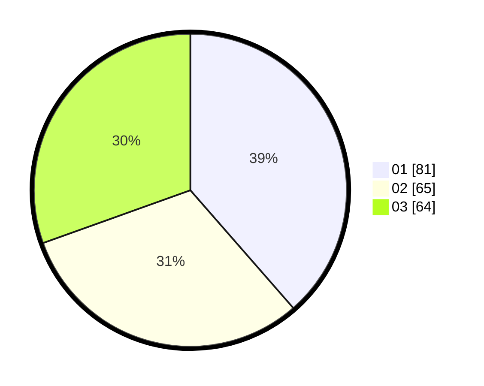

# Hasil

Hasil perolehan suara paslon dapat dilihat pada file paslon-01.txt, paslon-02.txt, dan paslon-03.txt.

Jika tidak ada, artinya data tersebut belum ada pada SIREKAP.

## Perolehan Suara

 * Paslon 01: **81**.
 * Paslon 02: **65**.
 * Paslon 03: **64**.

## Foto C Plano

https://sirekap-obj-formc.kpu.go.id/f95a/pemilu/ppwp/31/75/07/10/04/3175071004092-20240215-212631--4331325a-85ac-4126-8d18-6890ea87bc3c.jpg

https://sirekap-obj-formc.kpu.go.id/f95a/pemilu/ppwp/31/75/07/10/04/3175071004092-20240215-212636--ca3fba6d-1028-4f85-806b-86449db372a7.jpg

https://sirekap-obj-formc.kpu.go.id/f95a/pemilu/ppwp/31/75/07/10/04/3175071004092-20240215-212632--0b1a4b26-2415-485f-87a3-3b8b72e23bc0.jpg

## DATA PEMILIH TETAP

Jumlah pemilih dalam DPT: **245**.
 * L: **109**.
 * P: **136**.

## DATA PENGGUNA HAK PILIH

Jumlah pengguna hak pilih dalam DPT: **208**.
 * L: **90**.
 * P: **118**.

Jumlah pengguna hak pilih dalam DPTb: **1**.
 * L: **0**.
 * P: **1**.

Jumlah pengguna hak pilih dalam DPK: **4**.
 * L: **2**.
 * P: **2**.

Jumlah pengguna hak pilih: **213**.
 * L: **92**.
 * P: **121**.

## JUMLAH SUARA SAH DAN TIDAK SAH

JUMLAH SELURUH SUARA SAH: **210**.

JUMLAH SUARA TIDAK SAH: **3**.

JUMLAH SELURUH SUARA SAH DAN SUARA TIDAK SAH: **213**.
