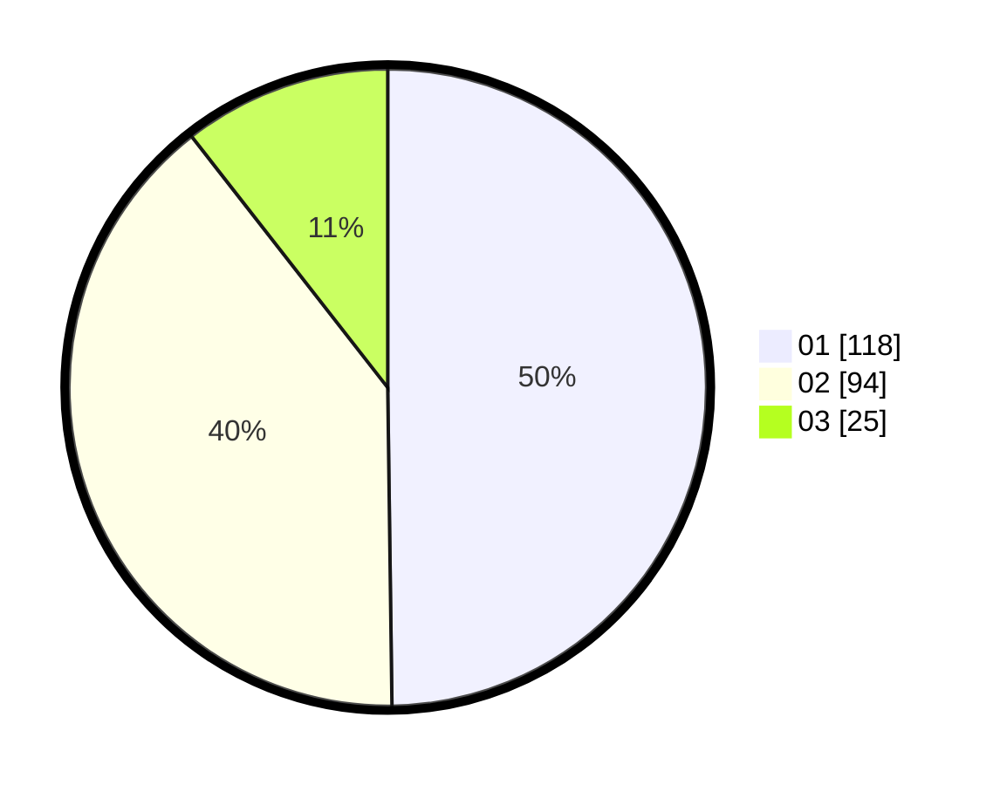

# Hasil

Hasil perolehan suara paslon dapat dilihat pada file paslon-01.txt, paslon-02.txt, dan paslon-03.txt.

Jika tidak ada, artinya data tersebut belum ada pada SIREKAP.

## Perolehan Suara

 * Paslon 01: **118**.
 * Paslon 02: **94**.
 * Paslon 03: **25**.

## Foto C Plano

https://sirekap-obj-formc.kpu.go.id/7105/pemilu/ppwp/31/75/07/10/04/3175071004099-20240214-215228--3399782e-ca08-44c2-b14d-8a3f19d51f81.jpg

https://sirekap-obj-formc.kpu.go.id/7105/pemilu/ppwp/31/75/07/10/04/3175071004099-20240214-213709--986b8e0e-45c8-4d0d-b7df-804edead491a.jpg

https://sirekap-obj-formc.kpu.go.id/7105/pemilu/ppwp/31/75/07/10/04/3175071004099-20240214-213556--8461d610-f326-4f1b-b4da-8fa705ac88ba.jpg

## DATA PEMILIH TETAP

Jumlah pemilih dalam DPT: **282**.
 * L: **123**.
 * P: **144**.

## DATA PENGGUNA HAK PILIH

Jumlah pengguna hak pilih dalam DPT: **235**.
 * L: **116**.
 * P: **119**.

Jumlah pengguna hak pilih dalam DPTb: **2**.
 * L: **1**.
 * P: **1**.

Jumlah pengguna hak pilih dalam DPK: **1**.
 * L: **0**.
 * P: **1**.

Jumlah pengguna hak pilih: **238**.
 * L: **117**.
 * P: **121**.

## JUMLAH SUARA SAH DAN TIDAK SAH

JUMLAH SELURUH SUARA SAH: **237**.

JUMLAH SUARA TIDAK SAH: **1**.

JUMLAH SELURUH SUARA SAH DAN SUARA TIDAK SAH: **238**.
