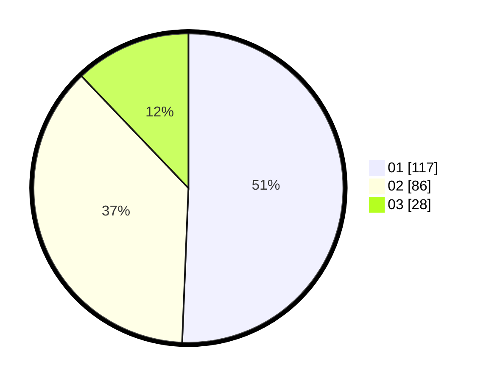

# Hasil

Hasil perolehan suara paslon dapat dilihat pada file paslon-01.txt, paslon-02.txt, dan paslon-03.txt.

Jika tidak ada, artinya data tersebut belum ada pada SIREKAP.

## Perolehan Suara

 * Paslon 01: **117**.
 * Paslon 02: **86**.
 * Paslon 03: **28**.

## Foto C Plano

https://sirekap-obj-formc.kpu.go.id/5cc2/pemilu/ppwp/31/75/07/10/04/3175071004100-20240214-221337--8da3a4e6-4ca3-4ab7-8edd-5fd8f6b58f1b.jpg

https://sirekap-obj-formc.kpu.go.id/5cc2/pemilu/ppwp/31/75/07/10/04/3175071004100-20240214-221637--557c88eb-e05c-433e-86c5-95c6402effe3.jpg

https://sirekap-obj-formc.kpu.go.id/5cc2/pemilu/ppwp/31/75/07/10/04/3175071004100-20240214-221759--5545641c-af6b-46bc-bab6-9360e1fb9e08.jpg

## DATA PEMILIH TETAP

Jumlah pemilih dalam DPT: **293**.
 * L: **148**.
 * P: **145**.

## DATA PENGGUNA HAK PILIH

Jumlah pengguna hak pilih dalam DPT: **232**.
 * L: **119**.
 * P: **113**.

Jumlah pengguna hak pilih dalam DPTb: **0**.
 * L: **0**.
 * P: **0**.

Jumlah pengguna hak pilih dalam DPK: **1**.
 * L: **0**.
 * P: **1**.

Jumlah pengguna hak pilih: **233**.
 * L: **119**.
 * P: **114**.

## JUMLAH SUARA SAH DAN TIDAK SAH

JUMLAH SELURUH SUARA SAH: **231**.

JUMLAH SUARA TIDAK SAH: **2**.

JUMLAH SELURUH SUARA SAH DAN SUARA TIDAK SAH: **233**.
