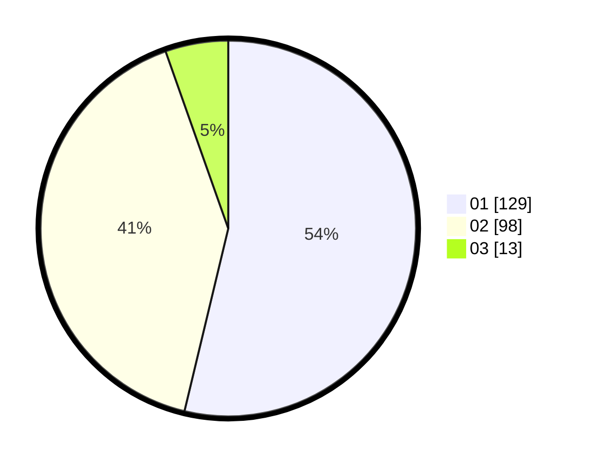

# Hasil

Hasil perolehan suara paslon dapat dilihat pada file paslon-01.txt, paslon-02.txt, dan paslon-03.txt.

Jika tidak ada, artinya data tersebut belum ada pada SIREKAP.

## Perolehan Suara

 * Paslon 01: **129**.
 * Paslon 02: **98**.
 * Paslon 03: **13**.

## Foto C Plano

https://sirekap-obj-formc.kpu.go.id/3c97/pemilu/ppwp/31/75/07/10/04/3175071004106-20240214-192715--0ec1ff25-d800-4745-93b8-5d8ff4ba2c9b.jpg

https://sirekap-obj-formc.kpu.go.id/3c97/pemilu/ppwp/31/75/07/10/04/3175071004106-20240214-191314--585ea307-441d-45ee-8191-3d22a8001770.jpg

https://sirekap-obj-formc.kpu.go.id/3c97/pemilu/ppwp/31/75/07/10/04/3175071004106-20240214-191933--0e71847b-4672-4e1e-9c27-5710378b557a.jpg

## DATA PEMILIH TETAP

Jumlah pemilih dalam DPT: **235**.
 * L: **113**.
 * P: **122**.

## DATA PENGGUNA HAK PILIH

Jumlah pengguna hak pilih dalam DPT: **235**.
 * L: **113**.
 * P: **122**.

Jumlah pengguna hak pilih dalam DPTb: **2**.
 * L: **1**.
 * P: **1**.

Jumlah pengguna hak pilih dalam DPK: **5**.
 * L: **2**.
 * P: **3**.

Jumlah pengguna hak pilih: **242**.
 * L: **116**.
 * P: **126**.

## JUMLAH SUARA SAH DAN TIDAK SAH

JUMLAH SELURUH SUARA SAH: **240**.

JUMLAH SUARA TIDAK SAH: **2**.

JUMLAH SELURUH SUARA SAH DAN SUARA TIDAK SAH: **242**.
