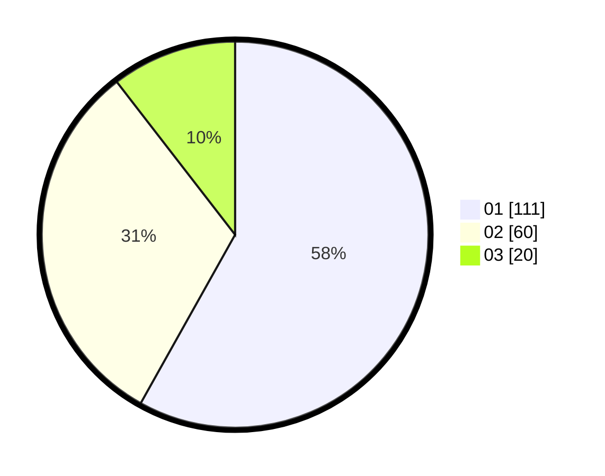

# Hasil

Hasil perolehan suara paslon dapat dilihat pada file paslon-01.txt, paslon-02.txt, dan paslon-03.txt.

Jika tidak ada, artinya data tersebut belum ada pada SIREKAP.

## Perolehan Suara

 * Paslon 01: **111**.
 * Paslon 02: **60**.
 * Paslon 03: **20**.

## Foto C Plano

https://sirekap-obj-formc.kpu.go.id/39b0/pemilu/ppwp/31/75/07/10/04/3175071004118-20240214-213854--6afa201c-b51b-4f82-91cc-7db287589e66.jpg

https://sirekap-obj-formc.kpu.go.id/39b0/pemilu/ppwp/31/75/07/10/04/3175071004118-20240214-213757--87c21c40-dd34-4d1c-8e30-4732200683a6.jpg

https://sirekap-obj-formc.kpu.go.id/39b0/pemilu/ppwp/31/75/07/10/04/3175071004118-20240214-213932--2b7e4e88-7a7a-4809-b45f-415493ae108b.jpg
